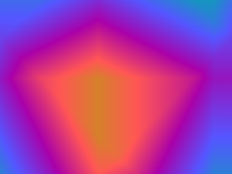
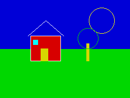

<p align="center">
  
</p>

# MinZ

MinZ is an experimental compiler toolchain for writing programs for Z80 machines with modern language features. **Nanz** is its main source language; Frill, C, Pascal, ABAP and other frontends also feed the shared HIR → MIR2 pipeline. The repository includes a Z80 assembler and emulators, so a small program can go from source to execution here.

The project is active research: examples and targets have different levels of maturity. Start with a runnable program below; use the [ranked backlog](docs/project/BACKLOG.md) and [dated technical audit](reports/2026-09-19-Deep-Technical-Audit-RU.md) for measured status.

## Run a program

Install [Go](https://go.dev/doc/install), then from the repository root:

```sh
git clone https://github.com/oisee/minz.git
cd minz
make -C minzc mz mza mze
mkdir -p build
minzc/mz examples/nanz/hello_cpm.nanz --target cpm -o build/hello.a80
minzc/mza build/hello.a80 -o build/hello.com
minzc/mze build/hello.com -t cpm
```

The emulator prints `Hello!`. The [Nanz source](examples/nanz/hello_cpm.nanz) is small enough to modify and rerun. For more programs, see [fun](fun/README.md) and [examples](examples/).

## What you can make

| ObjC plasma | Nanz canvas | Nanz rotozoomer |
| :---: | :---: | :---: |
|  |  |  |
| [ObjC source](examples/objc/plasma.m) | [Nanz source](examples/nanz/canvas_house.nanz) | [Nanz source](examples/nanz/rotozoomer.nanz) |

These images are current MIR2 VM canvas renders. Build `mzv` with `make -C minzc mzv`, then run `python3 scripts/build_rotozoomer_gif.py` to regenerate the GIF (requires Pillow). Run `cd minzc && go test ./pkg/c89 ./pkg/nanz -run '^(TestPlasmaRender|TestCanvasImplShowcase|TestRotozoomerGallery)$' -count=1` to compare the gallery with the current source. The CP/M example above exercises the Z80 path. [Gallery verification](reports/2026-10-01-README-Gallery-Verification-RU.md) · [Rotozoomer details](reports/2026-10-01-Nanz-Rotozoomer-RU.md).

## Explore

- [Nanz language book](docs/Nanz_Language_Book_v7.md) and [Frill guide](docs/Frill_Language_Guide.md)
- [Compiler architecture](docs/minz-compiler-architecture.md) and [MIR2 guide](docs/MIR_Architecture_Guide.md)
- [Installation](docs/INSTALLATION.md), [contributing](.github/CONTRIBUTING.md), and [documentation catalog](docs/Book_Catalog.md)
- [Reports](reports/), [research](research/), and [project backlog](docs/project/BACKLOG.md)

MinZ is released under the [MIT license](LICENSE).
