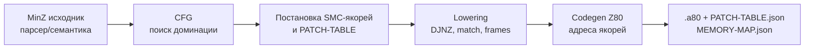
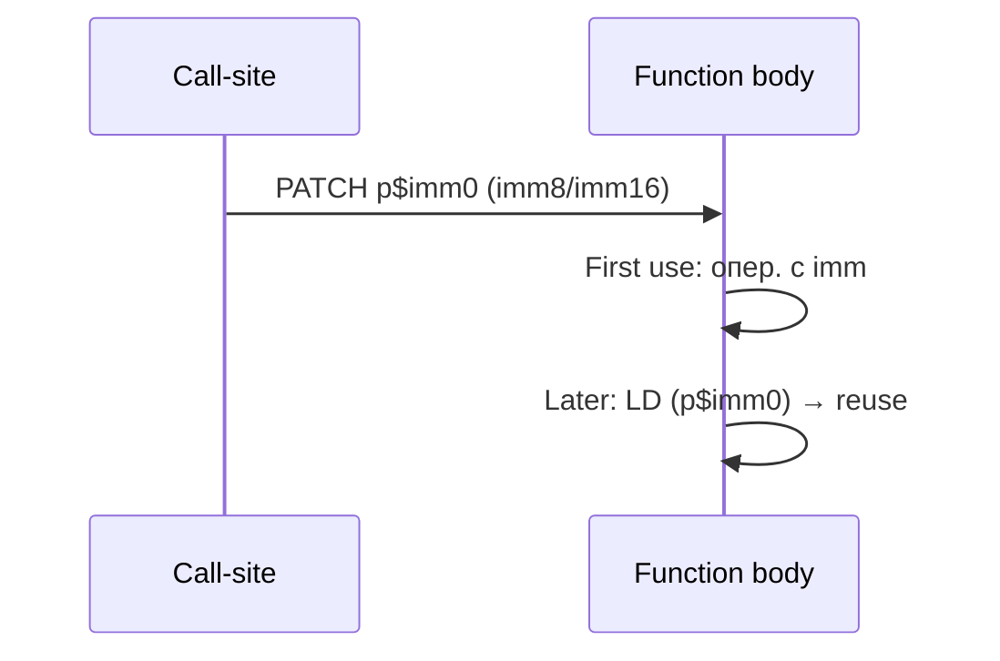

# ADR‑001: Истинный SMC через «якоря» в теле функции как дефолтный ABI для MinZ (Anti‑C Z80)

**Статус:** Принято  
**Дата:** 2025‑07‑26  
**Автор(ы):** MinZ Core (по результатам технической сессии)

---

## Контекст

MinZ стремится быть **anti‑C** языком для Z80: вместо стекоцентричных решений PDP‑эпохи — Z80‑нативные идиомы (иммедиаты, `DJNZ`, таблицы переходов, банки). Ключевая цель — **нулевая стоимость абстракций** и предсказуемые, быстрые генерации кода.

**Проблема:** Стандартные вызовы с передачей параметров через стек/`IX+d` дороги и мешают упрощённым быстрым паттернам на Z80.

**Наблюдение:** Истинный SMC на Z80 (патч байтов **операндов** в коде) позволяет рассматривать **код как память**: первый доступ — иммедиат, последующие — чтение из адреса этого иммедиата.

---

## Решение

Принять **истинный SMC‑подход с «якорями» параметров внутри тела функции** как **дефолтный ABI** при `target=RAM`:

1) Для каждого параметра функция имеет **один канонический SMC‑якорь** — первую точку употребления, эмитированную с **imm8/imm16**.  
2) Перед вызовом `CALL f` **патчим байты** операндов якорей `f` (по `PATCH‑TABLE`).  
3) Повторные использования параметров в теле функции:
   - повторно используют регистры, если живы;  
   - иначе **читают из адреса якоря** (`LD A,(p$imm0)` / `LD HL,(p$imm0)`).
4) Для рекурсии/реентерабельности применяется **SMC undo‑лог** (сохранение/восстановление байтов якорей на вход/выход кадра).

---

## Альтернативы (отклонены/ограничены)

- **Call‑site транки‑загрузчики регистров.** Отказались, т.к. они:
  - предполагают вместимость всех параметров в регистры «сразу»;
  - увеличивают код вокруг каждого вызова;
  - не используют адрес якоря как «слот из кода».
- **Чисто слот‑ABI по умолчанию.** Медленнее на первых доступах (нет выигрыша иммедиата); оставлен как fallback.
- **Стек‑ABI.** Классика C/PDP; противоречит цели anti‑C и дорого на Z80.

---

## Последствия

### Плюсы
- **Максимально быстрый первый доступ** (иммедиат).
- Естественная модель «код как память»: последующие доступы дёшевы и без стека.
- Простой, детерминированный ABI; понятные места патча.
- Отлично масштабируется на горячие циклы (патч один раз → многократное использование).

### Минусы/риски
- Требуется аккуратность с **ISR/NMI** и `imm16` (две записи) → `DI/EI` или пер‑контекстные копии.
- При **многочисленных ветках** без единого доминирующего «первого употребления» нужен синтетический якорь (добавляет 1 инструкцию).
- При **часто меняющихся параметрах** и малом числе повторных использований — SMC может не окупаться → применять `@abi(slot|reg)`.

---

## Подробности

### Размещение якоря (алгоритм)
1. Построить CFG. Найти доминирующую точку первого употребления для каждого параметра.  
2. Если операция позволяет иммедиат — встроить его; иначе — вставить `LD …, imm` непосредственно перед местом использования.  
3. Если единого доминирования нет — вставить синтетический якорь до ветвления.  
4. Записать адрес(а) и размер(ы) в `PATCH‑TABLE`.

### Рекурсия/реентерабельность
- Включить **SMC undo‑лог**: при каждом патче сохраняются предыдущие байты операндов якорей в SMC‑стек (undo), на выходе — восстановление.
- Для локалов — `@frame=spill` (копирование диапазона фикс‑слотов), либо `@frame=ringsize(N)`, либо `@frame=stack` (fallback).

### Итераторы и `&i`
- `for i in N..0` → `DJNZ`.  
- При `&i` компилятор материализует `i` в адресуемом слоте (добавляет write‑back или деоптимизирует `DJNZ`), `&i` не покидает лексическую область.

### Банки
- Патч якорей в другом банке — через `using bank[n]`.  
- Если банк нельзя безопасно подключить под патч — fallback на `@abi(slot)` в этом месте.

### Выбор ABI (эвристика)
- Дефолт — `@abi(smc)` (RAM).  
- Частые изменения параметров и мало повторных использований — `@abi(slot|reg)`.  
- ISR/NMI на тех же якорях — пер‑контекстные копии или `@abi(slot)`.  
- ROM — `@abi(slot|reg)`.

---

## Оценка производительности (эвристика окупаемости)

- `LD A, n` — ~7T; `LD A,(nn)` — ~13T → выигрыш ~6T на каждое использование.  
- Цена `imm8`‑патча — одна запись (≈13T).  
- Уже при **3+ использованиях** одного параметра в теле функция SMC обычно **окупается** (18T экономии против 13T записи), далее — чистый выигрыш.

---

## Риски и смягчения

- **Двоичная атомарность `imm16`.** Решение: `DI/EI` на время двух записей; по возможности — разносить патчи вне ISR; клонировать код для ISR.
- **Конкуренция по якорям.** Разнести якоря на **пер‑контекстные** копии кода; иначе — `@abi(slot)` для одной из сторон.
- **Рост кода** за счёт синтетических якорей. Обычно 1–2 байта на параметр/функцию, оправданно.

---

## Решение (кратко)

- Принять **SMC‑якоря в теле функции** как дефолтный ABI в RAM.  
- Интегрировать **SMC undo‑лог** для рекурсий/реентерабельности.  
- Зафиксировать **правила выбора ABI** и **инструменты** (PATCH‑TABLE, отчёты).

---

## Статус и дальнейшие шаги

- **Статус:** Принято.  
- **Далее:**
  1) Реализация `PATCH‑TABLE` и аннотированного листинга.  
  2) Генерация якорей и `-report-smc-anchors`.  
  3) SMC undo‑лог (`-fsmc-snapshot=undo|all`).  
  4) `@frame=spill|ringsize(N)` + отчёт по кадрам.  
  5) Тесты: ветвления, ISR, банки, `&i`/DJNZ, рекурсии.

---

## Диаграммы

### Поток компиляции

### Жизненный цикл параметра через якорь

