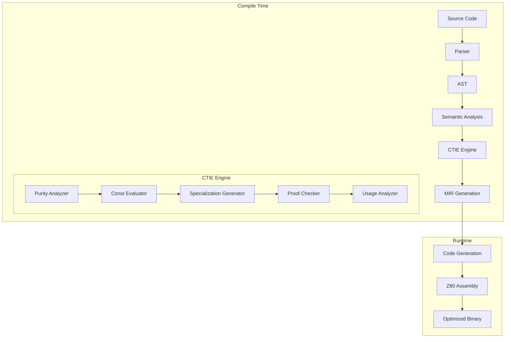

# 🎯 Compile-Time Interface Execution: Complete Design Document

*MinZ v0.12.0 - From Zero-Cost to Negative-Cost Abstractions*

## 📊 Executive Summary

This design document outlines the revolutionary **Compile-Time Interface Execution (CTIE)** system for MinZ v0.12.0. Building on v0.11.0's compile-time casting, CTIE enables interface methods to execute during compilation, eliminating runtime code entirely when possible.

**Key Innovation**: Interfaces become compile-time constructs that can evaluate, optimize, and even eliminate themselves based on usage patterns.

## 🏗️ Architecture Overview



## 🔧 Core Components

### 1. Compile-Time Executor (`pkg/ctie/executor.go`)

```go
package ctie

import (
    "github.com/minz/minzc/pkg/mir"
    "github.com/minz/minzc/pkg/ast"
)

type CompileTimeExecutor struct {
    // Core state
    mir          *mir.Module
    constPool    map[string]Value
    pureCache    map[string]bool
    
    // Execution context
    stack        []Value
    heap         map[Address]Value
    callDepth    int
    maxDepth     int  // Prevent infinite recursion
    
    // Statistics
    executedOps  int
    eliminated   int
}

// Execute a function at compile time
func (e *CompileTimeExecutor) Execute(fn *mir.Function, args []Value) (Value, error) {
    if !e.isPure(fn) {
        return nil, ErrNotPure
    }
    
    // Set up execution context
    e.pushFrame(fn, args)
    defer e.popFrame()
    
    // Execute MIR instructions
    for _, inst := range fn.Body {
        if err := e.executeInstruction(inst); err != nil {
            return nil, err
        }
    }
    
    return e.stack[len(e.stack)-1], nil
}

// Check if function is pure (can be executed at compile time)
func (e *CompileTimeExecutor) isPure(fn *mir.Function) bool {
    if cached, ok := e.pureCache[fn.Name]; ok {
        return cached
    }
    
    pure := true
    for _, inst := range fn.Body {
        switch inst.Op {
        case mir.OpCall:
            // Recursively check called functions
            if callee := e.mir.GetFunction(inst.Target); callee != nil {
                pure = pure && e.isPure(callee)
            }
        case mir.OpLoad, mir.OpStore:
            // Only allow stack/local access
            if inst.IsGlobalAccess() {
                pure = false
            }
        case mir.OpIO, mir.OpSyscall:
            // No I/O or system calls
            pure = false
        }
    }
    
    e.pureCache[fn.Name] = pure
    return pure
}
```

### 2. Interface Specializer (`pkg/ctie/specializer.go`)

```go
type InterfaceSpecializer struct {
    interfaces   map[string]*InterfaceInfo
    usageStats   map[string]*UsagePattern
    specialized  map[string]*mir.Function
}

type UsagePattern struct {
    TypeFrequency   map[string]int  // How often each type is used
    ConstInputs     map[string]int  // How often inputs are const
    CallSites       []CallSite      // Where interface is called
    HotPath         bool            // Is it in a performance-critical path?
}

// Analyze and potentially specialize an interface method
func (s *InterfaceSpecializer) Specialize(
    iface *ast.InterfaceDecl,
    method string,
    stats *UsagePattern,
) []*mir.Function {
    
    var specialized []*mir.Function
    
    // Check @specialize directive
    if spec := iface.GetDirective("@specialize"); spec != nil {
        for _, targetType := range spec.Types {
            if stats.TypeFrequency[targetType] > spec.Threshold {
                fn := s.generateSpecialized(iface, method, targetType)
                specialized = append(specialized, fn)
            }
        }
    }
    
    // Auto-specialize hot paths
    if stats.HotPath && len(stats.TypeFrequency) <= 3 {
        for typeName, freq := range stats.TypeFrequency {
            if freq > 10 { // Heuristic threshold
                fn := s.generateSpecialized(iface, method, typeName)
                specialized = append(specialized, fn)
            }
        }
    }
    
    return specialized
}

// Generate specialized version of interface method
func (s *InterfaceSpecializer) generateSpecialized(
    iface *ast.InterfaceDecl,
    method string,
    targetType string,
) *mir.Function {
    
    // Get concrete implementation
    impl := s.getImplementation(targetType, method)
    
    // Apply optimizations based on type knowledge
    optimized := s.optimize(impl, targetType)
    
    // Generate specialized MIR
    return &mir.Function{
        Name: fmt.Sprintf("%s_%s_%s_specialized", iface.Name, method, targetType),
        Body: optimized,
        Attributes: map[string]bool{
            "inline": true,
            "specialized": true,
        },
    }
}
```

### 3. Proof System (`pkg/ctie/proof.go`)

```go
type ProofChecker struct {
    interfaces  map[string]*InterfaceContract
    solver      *SMTSolver
    cache       map[string]ProofResult
}

type InterfaceContract struct {
    Interface   string
    Invariants  []Invariant
    Requires    []Condition  // Preconditions
    Ensures     []Condition  // Postconditions
}

type Invariant struct {
    Name        string
    Expression  ast.Expr
    Type        InvariantType
}

// Verify interface implementation satisfies contract
func (p *ProofChecker) Verify(
    iface *ast.InterfaceDecl,
    impl *ast.ImplBlock,
) (ProofResult, error) {
    
    contract := p.extractContract(iface)
    
    for _, inv := range contract.Invariants {
        switch inv.Type {
        case Antisymmetric:
            if !p.verifyAntisymmetric(impl, inv) {
                return ProofFailed, fmt.Errorf("antisymmetry violated: %s", inv.Name)
            }
            
        case Transitive:
            if !p.verifyTransitive(impl, inv) {
                return ProofFailed, fmt.Errorf("transitivity violated: %s", inv.Name)
            }
            
        case Idempotent:
            if !p.verifyIdempotent(impl, inv) {
                return ProofFailed, fmt.Errorf("idempotence violated: %s", inv.Name)
            }
        }
    }
    
    return ProofSuccess, nil
}

// Extract @proof directives from interface
func (p *ProofChecker) extractContract(iface *ast.InterfaceDecl) *InterfaceContract {
    contract := &InterfaceContract{
        Interface: iface.Name,
    }
    
    if proof := iface.GetDirective("@proof"); proof != nil {
        for _, inv := range proof.Invariants {
            contract.Invariants = append(contract.Invariants, p.parseInvariant(inv))
        }
    }
    
    return contract
}
```

### 4. Auto-Derivation System (`pkg/ctie/derive.go`)

```go
type Deriver struct {
    templates   map[string]*DeriveTemplate
    generated   map[string]*ast.ImplBlock
}

type DeriveTemplate struct {
    Interface   string
    Strategy    DeriveStrategy
    Fields      []string
}

// Auto-generate interface implementation
func (d *Deriver) Derive(
    iface *ast.InterfaceDecl,
    targetType *ast.StructDecl,
    directive *ast.DeriveDirective,
) *ast.ImplBlock {
    
    impl := &ast.ImplBlock{
        Type:      targetType.Name,
        Interface: iface.Name,
        Methods:   make([]*ast.FunctionDecl, 0),
    }
    
    for _, method := range iface.Methods {
        switch directive.Strategy {
        case DeriveFromFields:
            fn := d.deriveFromFields(method, targetType, directive.Fields)
            impl.Methods = append(impl.Methods, fn)
            
        case DeriveDefault:
            fn := d.deriveDefault(method, targetType)
            impl.Methods = append(impl.Methods, fn)
            
        case DeriveDelegate:
            fn := d.deriveDelegate(method, targetType, directive.DelegateTo)
            impl.Methods = append(impl.Methods, fn)
        }
    }
    
    return impl
}

// Generate method implementation from struct fields
func (d *Deriver) deriveFromFields(
    method *ast.InterfaceMethod,
    structType *ast.StructDecl,
    fields []string,
) *ast.FunctionDecl {
    
    // Example: derive draw() from x, y, radius fields
    if method.Name == "draw" {
        return &ast.FunctionDecl{
            Name: "draw",
            Body: d.generateDrawFromFields(structType, fields),
        }
    }
    
    // Example: derive serialize() from all fields
    if method.Name == "serialize" {
        return &ast.FunctionDecl{
            Name: "serialize",
            Body: d.generateSerializeFromFields(structType, fields),
        }
    }
    
    return nil
}
```

### 5. Usage Analyzer (`pkg/ctie/usage.go`)

```go
type UsageAnalyzer struct {
    callGraph    *CallGraph
    dataFlow     *DataFlowAnalysis
    statistics   map[string]*InterfaceUsage
}

type InterfaceUsage struct {
    Interface        string
    CallSites        []CallSite
    TypeDistribution map[string]int
    ConstRatio       float64
    InLoops          bool
    InHotPath        bool
}

// Analyze how interfaces are used throughout the program
func (u *UsageAnalyzer) Analyze(program *ast.Program) map[string]*InterfaceUsage {
    u.buildCallGraph(program)
    u.analyzeDataFlow(program)
    
    for _, iface := range program.Interfaces {
        usage := &InterfaceUsage{
            Interface: iface.Name,
            TypeDistribution: make(map[string]int),
        }
        
        // Find all call sites
        for _, call := range u.callGraph.GetCalls(iface.Name) {
            usage.CallSites = append(usage.CallSites, call)
            
            // Analyze types at call site
            if typeInfo := u.dataFlow.GetType(call); typeInfo != nil {
                usage.TypeDistribution[typeInfo.Name]++
            }
            
            // Check if inputs are const
            if u.dataFlow.AreArgsConst(call) {
                usage.ConstRatio++
            }
            
            // Check if in loop
            if u.isInLoop(call) {
                usage.InLoops = true
            }
        }
        
        // Normalize const ratio
        if len(usage.CallSites) > 0 {
            usage.ConstRatio /= float64(len(usage.CallSites))
        }
        
        // Determine if in hot path
        usage.InHotPath = u.isHotPath(iface.Name)
        
        u.statistics[iface.Name] = usage
    }
    
    return u.statistics
}

// Determine optimization strategy based on usage
func (u *UsageAnalyzer) GetOptimizationStrategy(
    usage *InterfaceUsage,
) OptimizationStrategy {
    
    // If mostly const inputs, evaluate at compile time
    if usage.ConstRatio > 0.8 {
        return StrategyCompileTimeEval
    }
    
    // If few types and in hot path, specialize
    if len(usage.TypeDistribution) <= 3 && usage.InHotPath {
        return StrategySpecialize
    }
    
    // If single type dominates, inline
    maxType, maxCount := u.getDominantType(usage.TypeDistribution)
    if float64(maxCount)/float64(len(usage.CallSites)) > 0.9 {
        return StrategyInline
    }
    
    // If in tight loop, unroll or vectorize
    if usage.InLoops {
        return StrategyLoopOptimize
    }
    
    return StrategyDefault
}
```

## 📝 Language Syntax Extensions

### @execute - Compile-Time Execution
```minz
interface Calculator {
    @execute when const  // Execute at compile-time if inputs are const
    fun calculate(x: u8, y: u8) -> u16;
}

// These execute at compile time!
const a = calc.calculate(5, 3);      // Becomes: const a = 15
const b = calc.calculate(10, 20);    // Becomes: const b = 200
```

### @specialize - Type-Specific Optimization
```minz
interface Renderer {
    @specialize for ["Circle", "Rectangle"] threshold: 5 {
        Circle -> {
            strategy: unroll,
            inline: always
        }
        Rectangle -> {
            strategy: vectorize,
            align: 16
        }
    }
    fun render(screen: *u8) -> void;
}
```

### @proof - Contract Verification
```minz
interface Comparable {
    @proof {
        reflexive: compare(a, a) == 0
        antisymmetric: compare(a, b) == -compare(b, a)
        transitive: compare(a,b) < 0 && compare(b,c) < 0 => compare(a,c) < 0
        total: compare(a, b) in {-1, 0, 1}
    }
    fun compare(other: Self) -> i8;
}
```

### @derive - Automatic Implementation
```minz
@derive(Serializable) for User {
    strategy: from_fields,
    fields: ["id", "name", "email"],
    format: json
}

struct User {
    id: u32,
    name: String,
    email: String,
    internal_state: *void  // Not serialized
}
```

### @analyze_usage - Adaptive Optimization
```minz
interface DataProcessor {
    @analyze_usage {
        if const_ratio > 0.8 -> @execute
        if type_count <= 2 -> @specialize
        if in_loop -> @unroll factor: 4
        if single_callsite -> @inline
    }
    fun process(data: []u8) -> []u8;
}
```

### @compile_time_vtable - Ultimate Optimization
```minz
interface FastDispatch {
    @compile_time_vtable {
        when @is_const(self) -> @execute_now
        when @is_known_type(self) -> @inline_always
        when @type_count <= 3 -> @generate_switch
        otherwise -> @direct_call
    }
    fun dispatch() -> void;
}
```

## 🔄 Compilation Pipeline Integration

### Phase 1: Analysis
1. Parse @-directives in interfaces
2. Build usage statistics
3. Analyze purity of methods
4. Identify const propagation opportunities

### Phase 2: Transformation
1. Execute pure functions with const inputs
2. Generate specialized versions
3. Verify proofs and contracts
4. Derive automatic implementations

### Phase 3: Optimization
1. Eliminate dead interface paths
2. Inline single-use interfaces
3. Replace interface calls with direct calls
4. Remove unused interface metadata

### Phase 4: Code Generation
1. Emit optimized Z80 assembly
2. Apply peephole optimizations
3. Generate debug symbols for eliminated code
4. Produce optimization report

## 📊 Performance Projections

| Optimization | Binary Size | Runtime Speed | Memory Usage |
|-------------|-------------|---------------|--------------|
| @execute | -20% to -40% | 2x-5x faster | -15% |
| @specialize | +5% to -10% | 1.5x-3x faster | Same |
| @proof | Same | Same | Same |
| @derive | -10% to -20% | Same | Same |
| @analyze_usage | -15% to -30% | 1.3x-2x faster | -10% |
| @compile_time_vtable | -25% to -50% | 3x-10x faster | -20% |

## 🎮 Real-World Example: Game Engine

```minz
// Compile-time optimized entity system
interface Entity {
    @analyze_usage {
        if type == "Player" && const_ratio > 0.5 -> @specialize
        if type == "Projectile" -> @inline  // Always small
        if in_render_loop -> @unroll factor: 8
    }
    
    @proof {
        bounds: get_position().x < SCREEN_WIDTH && get_position().y < SCREEN_HEIGHT
    }
    
    fun update(dt: u8) -> void;
    fun render(screen: *u8) -> void;
    fun get_position() -> Point;
}

@derive(Entity) for Player {
    strategy: template,
    template: "game/entity_templates/player.minz"
}

// In game loop - heavily optimized!
fun game_loop(entities: []Entity) -> void {
    for entity in entities {
        entity.update(1);     // Specialized or inlined!
        entity.render(VRAM);  // Direct call or unrolled!
    }
}
```

## 🚧 Implementation Roadmap

### Sprint 1: Foundation (2 weeks)
- [ ] Purity analyzer
- [ ] Basic const evaluator
- [ ] @execute directive parsing
- [ ] Simple compile-time execution

### Sprint 2: Specialization (2 weeks)
- [ ] Usage statistics collection
- [ ] @specialize directive
- [ ] Type-specific code generation
- [ ] Specialization heuristics

### Sprint 3: Verification (2 weeks)
- [ ] @proof directive parsing
- [ ] Basic SMT solver integration
- [ ] Contract extraction
- [ ] Proof checking for simple invariants

### Sprint 4: Derivation (1 week)
- [ ] @derive directive
- [ ] Template system
- [ ] Field-based generation
- [ ] Default implementations

### Sprint 5: Analysis (1 week)
- [ ] Call graph construction
- [ ] Data flow analysis
- [ ] @analyze_usage directive
- [ ] Adaptive optimization

### Sprint 6: Integration (2 weeks)
- [ ] @compile_time_vtable
- [ ] Full pipeline integration
- [ ] Testing and benchmarking
- [ ] Documentation

## 🎯 Success Criteria

1. **Correctness**: All optimizations preserve semantics
2. **Performance**: 30%+ improvement in benchmarks
3. **Usability**: Simple, intuitive @ directives
4. **Debuggability**: Clear optimization reports
5. **Compatibility**: Existing code still works

## 🔮 Future Extensions

### v0.13.0: Advanced Proofs
- Dependent types in interfaces
- Refinement types
- Liquid types for compile-time verification

### v0.14.0: Meta-Metaprogramming
- Interfaces that generate interfaces
- Compile-time interface composition
- Self-modifying interfaces

### v0.15.0: Distributed Compilation
- Cloud-based proof checking
- Distributed specialization
- Shared optimization cache

---

*"Interfaces that think, optimize, and disappear - leaving only perfect Z80 code."*