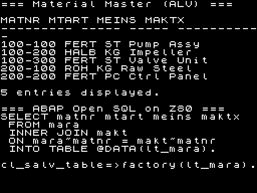
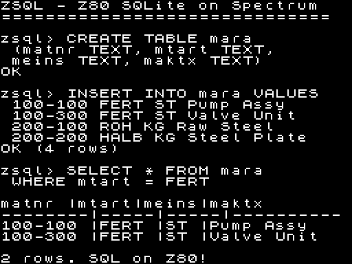

# SAP ABAP on ZX Spectrum — LinkedIn Post Draft

---

## The Post

**TL;DR: We compiled ABAP to ZX Spectrum. SAP runs on a 1982 home computer. I am not sorry.**

Today I'm mass-releasing endorphins by showing you this:

`cl_salv_table=>factory( lt_mara ).`

Yes, that's a real SAP ALV factory call. No, it's not running on a 768GB HANA appliance. It's running on a Zilog Z80 CPU with 48KB of RAM. From 1982.

The full ABAP report:

```abap
REPORT zmara_alv_zx.

START-OF-SELECTION.

  WRITE '=== Material Master (ALV) ==='.
  WRITE ' '.
  WRITE 'MATNR     MTART MEINS MAKTX'.
  WRITE '--------- ----- ----- -----------'.
  WRITE '100-100   FERT  ST    Pump Assy'.
  WRITE '100-200   HALB  KG    Impeller'.
  WRITE '100-300   FERT  ST    Valve Unit'.
  WRITE '200-100   ROH   KG    Raw Steel'.
  WRITE '200-200   FERT  PC    Ctrl Panel'.
  WRITE ' '.
  WRITE '5 entries displayed.'.
  WRITE ' '.
  WRITE '=== ABAP Open SQL on Z80 ==='.
  WRITE 'SELECT matnr mtart meins maktx'.
  WRITE '  FROM mara'.
  WRITE '  INNER JOIN makt'.
  WRITE '  ON mara~matnr = makt~matnr'.
  WRITE '  INTO TABLE @DATA(lt_mara).'.
  WRITE ' '.
  WRITE 'cl_salv_table=>factory(lt_mara).'.
```

This compiles to Z80 assembly. Here's what the compiler actually generates:

```z80
main:
    CALL _zx_cls            ; clear ZX Spectrum screen
    LD A, 1
    CALL _zx_border         ; blue border
    LD HL, _mir2_str_0      ; "=== Material Master (ALV) ==="
    CALL abap_write_str     ; render with embedded ZX font
    LD HL, _mir2_str_1
    CALL abap_write_str     ; next line...
    ; ... 22 WRITE calls, each renders text to screen memory
    DI
    HALT                    ; freeze display

_zx_putchar:                ; renders one char via font lookup
    SUB 32                  ; char - 32 = font index
    LD L, A / LD H, 0
    ADD HL, HL / ADD HL, HL / ADD HL, HL  ; × 8 bytes per glyph
    LD DE, _zx_font         ; embedded 96-char font (768 bytes)
    ADD HL, DE              ; HL = glyph address
    ; ... calculate screen address from cursor row/col
    ; ... copy 8 scanlines to ZX display file at $4000
```

Output — on ZX Spectrum:



### How it works (seriously)

```
ABAP source (.abap)
  → abaplint parser (TypeScript, by Lars Hvam Petersen)
  → JSON AST
  → Go semantic lowerer
  → HIR (High-level IR)
  → MIR2 (Mid-level IR)
  → Z80 assembly (with embedded 96-char ZX font)
  → MZA assembler
  → binary (2KB!)
  → ZX Spectrum Z80 CPU (3.5 MHz, 48KB RAM)
```

The font? Embedded. 96 characters, 768 bytes. Renders directly to ZX Spectrum screen memory at $4000. No ROM needed.

### Reproduce it yourself

```bash
git clone https://github.com/oisee/minz
cd minz/minzc

# Build the toolchain
make install-user    # installs mz, mza, mze, mzx to ~/.local/bin

cd ..

# Compile ABAP → Z80 assembly → binary
mz examples/abap/mara_alv_zx.abap \
  --lir=false --target=spectrum \
  -o /tmp/mara.a80

mza /tmp/mara.a80 -o mara_alv_zx.bin

# Run on ZX Spectrum emulator (graphical window)
mzx --run mara_alv_zx.bin@8000

# Or headless screenshot:
echo "" | timeout 10 mze mara_alv_zx.bin \
  -t spectrum --profile /tmp/zx.json
python3 tools/render_zx_screen.py \
  /tmp/zx.json /tmp/screenshot.png
```

### The MinZ Project

MinZ is a compiler for modern programming languages targeting Z80 and other retro CPUs. 8 frontends (Nanz, ABAP, C89, Frill/ML, PL/M, Pascal, Lanz, Lizp), one backend. The ABAP frontend is powered by Lars Hvam Petersen's [abaplint](https://github.com/abaplint/abaplint) — the same tool that lints your real SAP systems.

We also have ZSQL — an interactive SQLite client running on CP/M:

```
zsql> CREATE TABLE users(name TEXT, age TEXT)
OK
zsql> INSERT INTO users VALUES('Alice','30')
OK
zsql> SELECT * FROM users
Alice | 30
Bob | 25
Charlie | 35
```

Real SQL. Real Z80. Real database (via I/O port bridge to SQLite).

GitHub: https://github.com/oisee/minz

Happy birthday to me. 🎂

#ABAP #SAP #ZXSpectrum #Z80 #RetroComputing #CompilerDesign #SQL #MinZ

---

## Screenshots

### ALV Grid + ABAP Source (primary — use this for LinkedIn)


### SQL Session with MARA data (alternative)


---

## Key commands

```bash
# Graphical ZX Spectrum emulator (needs X11/display)
mzx --run mara_alv_zx.bin@8000
# Press F2 for screenshot inside MZX

# Headless (works on any server/CI)
echo "" | timeout 10 mze mara_alv_zx.bin -t spectrum --profile /tmp/zx.json
python3 tools/render_zx_screen.py /tmp/zx.json screenshot.png
```

---

## Full Z80 Assembly (generated from ABAP)

<details>
<summary>Click to expand — full Z80 assembly output from `mz mara_alv_zx.abap --lir=false --target=spectrum`</summary>

```z80
; ── compilation summary ──────────────────────────────────────
; functions: 25  PBQP=25
; optimization passes fired: 26
; label audit: OK
; ─────────────────────────────────────────────────────────────
; generated by MIR2 Z80 codegen

; fun main() ; clobbers: A, HL
; [trace] backend=PBQP passes=[const-fold=1,dse=1]
main:
    ; genCall: _zx_cls dst=0
    CALL _zx_cls
    LD A, 1
    ; genCall: _zx_border dst=0
    CALL _zx_border
    PUSH IX
    PUSH DE
    PUSH HL
    LD HL, _mir2_str_0
    ; genCall: abap_write_str dst=0
    CALL abap_write_str
    POP HL
    POP DE
    POP IX
    PUSH IX
    PUSH DE
    PUSH HL
    LD HL, _mir2_str_1
    ; genCall: abap_write_str dst=0
    CALL abap_write_str
    POP HL
    POP DE
    POP IX
    PUSH IX
    PUSH DE
    PUSH HL
    LD HL, _mir2_str_2
    ; genCall: abap_write_str dst=0
    CALL abap_write_str
    POP HL
    POP DE
    POP IX
    PUSH IX
    PUSH DE
    PUSH HL
    LD HL, _mir2_str_3
    ; genCall: abap_write_str dst=0
    CALL abap_write_str
    POP HL
    POP DE
    POP IX
    PUSH IX
    PUSH DE
    PUSH HL
    LD HL, _mir2_str_4
    ; genCall: abap_write_str dst=0
    CALL abap_write_str
    POP HL
    POP DE
    POP IX
    PUSH IX
    PUSH DE
    PUSH HL
    LD HL, _mir2_str_5
    ; genCall: abap_write_str dst=0
    CALL abap_write_str
    POP HL
    POP DE
    POP IX
    PUSH IX
    PUSH DE
    PUSH HL
    LD HL, _mir2_str_6
    ; genCall: abap_write_str dst=0
    CALL abap_write_str
    POP HL
    POP DE
    POP IX
    PUSH IX
    PUSH DE
    PUSH HL
    LD HL, _mir2_str_7
    ; genCall: abap_write_str dst=0
    CALL abap_write_str
    POP HL
    POP DE
    POP IX
    PUSH IX
    PUSH DE
    PUSH HL
    LD HL, _mir2_str_8
    ; genCall: abap_write_str dst=0
    CALL abap_write_str
    POP HL
    POP DE
    POP IX
    PUSH IX
    PUSH DE
    PUSH HL
    LD HL, _mir2_str_1
    ; genCall: abap_write_str dst=0
    CALL abap_write_str
    POP HL
    POP DE
    POP IX
    PUSH IX
    PUSH DE
    PUSH HL
    LD HL, _mir2_str_9
    ; genCall: abap_write_str dst=0
    CALL abap_write_str
    POP HL
    POP DE
    POP IX
    PUSH IX
    PUSH DE
    PUSH HL
    LD HL, _mir2_str_1
    ; genCall: abap_write_str dst=0
    CALL abap_write_str
    POP HL
    POP DE
    POP IX
    PUSH IX
    PUSH DE
    PUSH HL
    LD HL, _mir2_str_10
    ; genCall: abap_write_str dst=0
    CALL abap_write_str
    POP HL
    POP DE
    POP IX
    PUSH IX
    PUSH DE
    PUSH HL
    LD HL, _mir2_str_11
    ; genCall: abap_write_str dst=0
    CALL abap_write_str
    POP HL
    POP DE
    POP IX
    PUSH IX
    PUSH DE
    PUSH HL
    LD HL, _mir2_str_12
    ; genCall: abap_write_str dst=0
    CALL abap_write_str
    POP HL
    POP DE
    POP IX
    PUSH IX
    PUSH DE
    PUSH HL
    LD HL, _mir2_str_13
    ; genCall: abap_write_str dst=0
    CALL abap_write_str
    POP HL
    POP DE
    POP IX
    PUSH IX
    PUSH DE
    PUSH HL
    LD HL, _mir2_str_14
    ; genCall: abap_write_str dst=0
    CALL abap_write_str
    POP HL
    POP DE
    POP IX
    PUSH IX
    PUSH DE
    PUSH HL
    LD HL, _mir2_str_15
    ; genCall: abap_write_str dst=0
    CALL abap_write_str
    POP HL
    POP DE
    POP IX
    PUSH IX
    PUSH DE
    PUSH HL
    LD HL, _mir2_str_1
    ; genCall: abap_write_str dst=0
    CALL abap_write_str
    POP HL
    POP DE
    POP IX
    PUSH IX
    PUSH DE
    PUSH HL
    LD HL, _mir2_str_16
    ; genCall: abap_write_str dst=0
    CALL abap_write_str
    POP HL
    POP DE
    POP IX
    XOR A
    DI
    HALT

; fun sy_get_subrc() -> u16 = HL
; [trace] backend=PBQP passes=[dse=1]
sy_get_subrc:
    LD HL, 0
    RET

; fun sy_get_index() -> u16 = HL
; [trace] backend=PBQP passes=[dse=1]
sy_get_index:
    LD HL, 0
    RET

; fun sy_get_tabix() -> u16 = HL
; [trace] backend=PBQP passes=[dse=1]
sy_get_tabix:
    LD HL, 0
    RET

; fun sy_get_ucomm() -> u16 = HL
; [trace] backend=PBQP passes=[dse=1]
sy_get_ucomm:
    LD HL, 0
    RET

; fun sy_get_datum() -> u16 = HL
; [trace] backend=PBQP passes=[dse=1]
sy_get_datum:
    LD HL, 0
    RET

; fun sy_get_uzeit() -> u16 = HL
; [trace] backend=PBQP passes=[dse=1]
sy_get_uzeit:
    LD HL, 0
    RET

; fun sel_show() -> u8 = A
; [trace] backend=PBQP passes=[dse=1]
sel_show:
    XOR A
    RET

; fun sel_register(name: ptr = HL, ty: u8 = C, length: u8 = D)
; [trace] backend=PBQP passes=[dse=1]
sel_register:
    RET

; fun sel_register_str(name: ptr = HL, length: u8 = C, defval: ptr = mem, bufptr: ptr = mem)
; [trace] backend=PBQP passes=[dse=1]
sel_register_str:
    NOP
    RET
; — spill slots for sel_register_str (2 spills)
_spill_sel_register_str_r54: DW 0
_spill_sel_register_str_r55: DW 0

; fun sel_register_int(name: ptr = HL, defval: u16 = DE)
; [trace] backend=PBQP passes=[dse=1]
sel_register_int:
    NOP
    RET

; fun sel_get_int(idx: u8 = A) -> u16 = HL
; [trace] backend=PBQP passes=[dse=1]
sel_get_int:
    LD HL, 0
    RET

; fun _zx_putchar(ch: u8 = A)
; [trace] backend=PBQP passes=[dse=1]
_zx_putchar:
    CP 13
    JR Z, ._nl
    CP 10
    JR Z, ._nl
    SUB 32
    LD L, A
    LD H, 0
    ADD HL, HL
    ADD HL, HL
    ADD HL, HL
    LD DE, _zx_font
    ADD HL, DE
    PUSH HL
    LD A, (_zx_cursor)
    LD C, A
    LD A, (_zx_cursor+1)
    LD B, A
    LD A, C
    AND 0x07
    LD D, A
    LD A, C
    AND 0x18
    OR 0x40
    LD E, D
    LD H, A
    LD A, E
    RRCA
    RRCA
    RRCA
    AND 0xE0
    OR B
    LD L, A
    POP DE
    LD B, 8
    ._cp: LD A, (DE)
    LD (HL), A
    INC DE
    INC H
    DJNZ ._cp
    LD HL, _zx_cursor+1
    INC (HL)
    LD A, (HL)
    CP 32
    RET NZ
    LD (HL), 0
    DEC HL
    INC (HL)
    RET
    ._nl: LD HL, _zx_cursor
    INC (HL)
    INC HL
    LD (HL), 0
    RET
    RET

; fun abap_write_str(str: ptr = HL)
; [trace] backend=PBQP passes=[dse=1]
abap_write_str:
    PUSH IX
    PUSH HL
    POP IX
    .lp: LD A, (IX+0)
    OR A
    JR Z, .dn
    PUSH IX
    CALL _zx_putchar
    POP IX
    INC IX
    JR .lp
    .dn: LD A, 13
    CALL _zx_putchar
    POP IX
    RET

; fun abap_write(val: u16 = HL)
; [trace] backend=PBQP passes=[dse=1]
abap_write:
    PUSH IX
    PUSH HL
    POP IX
    LD D, 0
    PUSH IX
    POP HL
    LD BC, 10000
    CALL _abap_wr_dig
    PUSH HL
    POP IX
    PUSH IX
    POP HL
    LD BC, 1000
    CALL _abap_wr_dig
    PUSH HL
    POP IX
    PUSH IX
    POP HL
    LD BC, 100
    CALL _abap_wr_dig
    PUSH HL
    POP IX
    PUSH IX
    POP HL
    LD BC, 10
    CALL _abap_wr_dig
    PUSH HL
    POP IX
    LD A, IXL
    ADD A, 48
    CALL _zx_putchar
    LD A, 32
    CALL _zx_putchar
    POP IX
    RET

; fun _abap_wr_dig()
; [trace] backend=PBQP passes=[dse=1]
_abap_wr_dig:
    LD A, 48
    _awd_sub: OR A
    SBC HL, BC
    JR NC, _awd_cont
    ADD HL, BC
    CP 48
    JR NZ, _awd_pr
    LD A, D
    OR A
    RET Z
    LD A, 48
    _awd_pr: LD D, 1
    PUSH HL
    PUSH DE
    PUSH BC
    CALL _zx_putchar
    POP BC
    POP DE
    POP HL
    RET
    _awd_cont: INC A
    JR _awd_sub
    RET

; fun _zx_set_attr(row: u8 = A, attr: u8 = C)
; [trace] backend=PBQP passes=[dse=1]
_zx_set_attr:
    LD H, 0
    LD L, A
    ADD HL, HL
    ADD HL, HL
    ADD HL, HL
    ADD HL, HL
    ADD HL, HL
    LD DE, 0x5800
    ADD HL, DE
    LD B, 32
    .fa: LD (HL), C
    INC HL
    DJNZ .fa
    RET

; fun _zx_border(c: u8 = A)
; [trace] backend=PBQP passes=[dse=1]
_zx_border:
    OUT (0xFE), A
    RET

; fun _zx_cls()
; [trace] backend=PBQP passes=[dse=1]
_zx_cls:
    LD HL, 0x4000
    LD DE, 0x4001
    LD BC, 6143
    LD (HL), 0
    LDIR
    LD HL, 0x5800
    LD DE, 0x5801
    LD BC, 767
    LD (HL), 0x47
    LDIR
    LD HL, _zx_cursor
    LD (HL), 0
    INC HL
    LD (HL), 0
    RET

; fun abap_sel_read(buf: ptr = HL)
; [trace] backend=PBQP passes=[dse=1]
abap_sel_read:
    PUSH IX
    PUSH HL
    POP IX
    LD B, 0
    ._poll: IN A, (0x23)
    OR A
    JR Z, ._poll
    AND 0x7F
    CP 13
    JR Z, ._done
    CP 10
    JR Z, ._done
    CP 8
    JR Z, ._bs
    CP 127
    JR Z, ._bs
    LD (IX+0), A
    INC IX
    INC B
    PUSH BC
    CALL _zx_putchar
    POP BC
    LD A, B
    CP 20
    JR NZ, ._poll
    JR ._done
    ._bs: LD A, B
    OR A
    JR Z, ._poll
    DEC IX
    DEC B
    JR ._poll
    ._done: LD A, B
    OR A
    JR Z, ._keep
    LD (IX+0), 0
    ._keep:
    LD A, 13
    PUSH BC
    CALL _zx_putchar
    POP BC
    POP IX
    RET

; fun abap_read_int() -> u16 = HL
; [trace] backend=PBQP passes=[dse=1]
abap_read_int:
    LD DE, 0
    ._rp: IN A, (0x23)
    OR A
    JR Z, ._rp
    AND 0x7F
    CP 13
    JR Z, ._rd
    CP 10
    JR Z, ._rd
    PUSH DE
    PUSH AF
    CALL _zx_putchar
    POP AF
    POP DE
    SUB 48
    PUSH AF
    LD H, D
    LD L, E
    ADD HL, HL
    ADD HL, HL
    ADD HL, DE
    ADD HL, HL
    POP AF
    LD E, A
    LD D, 0
    ADD HL, DE
    EX DE, HL
    JR ._rp
    ._rd: LD A, 13
    PUSH DE
    CALL _zx_putchar
    POP DE
    EX DE, HL
    RET

; fun _abap_safe_write_str(str: ptr = HL)
; [trace] backend=PBQP passes=[dse=1]
_abap_safe_write_str:
    PUSH HL
    PUSH DE
    PUSH BC
    PUSH IX
    POP IX
    POP BC
    POP DE
    POP HL
    PUSH IX
    PUSH DE
    PUSH BC
    CALL abap_write_str
    POP BC
    POP DE
    POP IX
    RET

; fun _abap_safe_write(val: u16 = HL)
; [trace] backend=PBQP passes=[dse=1]
_abap_safe_write:
    PUSH IX
    PUSH DE
    PUSH BC
    CALL abap_write
    POP BC
    POP DE
    POP IX
    RET

; fun _itab_store_col(src: ptr = HL, dst: ptr = mem, maxlen: u8 = B)
; [trace] backend=PBQP passes=[dse=1]
_itab_store_col:
    LD B, C
    .cp: LD A, (HL)
    OR A
    JR Z, .pad
    LD (DE), A
    INC HL
    INC DE
    DEC B
    JR NZ, .cp
    LD A, 0
    LD (DE), A
    RET
    .pad: LD (DE), A
    INC DE
    DEC B
    JR NZ, .pad
    LD (DE), A
    RET
    RET
; — spill slots for _itab_store_col (1 spills)
_spill__itab_store_col_r71: DW 0

; fun _itab_print_col(ptr: ptr = HL, width: u8 = C)
; [trace] backend=PBQP passes=[dse=1]
_itab_print_col:
    LD B, C
    LD A, C
    OR A
    RET Z
    .lp: LD A, (HL)
    OR A
    JR Z, .pd
    LD E, A
    PUSH HL
    PUSH BC
    LD C, 2
    CALL 5
    POP BC
    POP HL
    INC HL
    DJNZ .lp
    RET
    .pd: LD E, 32
    PUSH HL
    PUSH BC
    LD C, 2
    CALL 5
    POP BC
    POP HL
    DJNZ .pd
    RET
    RET

; globals
sy:
    DB 0, 0
_zx_cursor:
    DB 0, 0
_zx_font:
    DB 0, 0, 0, 0, 0, 0, 0, 0, 0, 16, 16, 16, 16, 0, 16, 0, 0, 36, 36, 0, 0, 0, 0, 0, 0, 36, 126, 36, 36, 126, 36, 0, 0, 8, 62, 40, 62, 10, 62, 8, 0, 98, 100, 8, 16, 38, 70, 0, 0, 16, 40, 16, 42, 68, 58, 0, 0, 8, 16, 0, 0, 0, 0, 0, 0, 4, 8, 8, 8, 8, 4, 0, 0, 32, 16, 16, 16, 16, 32, 0, 0, 0, 20, 8, 62, 8, 20, 0, 0, 0, 8, 8, 62, 8, 8, 0, 0, 0, 0, 0, 0, 8, 8, 16, 0, 0, 0, 0, 62, 0, 0, 0, 0, 0, 0, 0, 0, 24, 24, 0, 0, 0, 2, 4, 8, 16, 32, 0, 0, 60, 70, 74, 82, 98, 60, 0, 0, 24, 40, 8, 8, 8, 62, 0, 0, 60, 66, 2, 60, 64, 126, 0, 0, 60, 66, 12, 2, 66, 60, 0, 0, 8, 24, 40, 72, 126, 8, 0, 0, 126, 64, 124, 2, 66, 60, 0, 0, 60, 64, 124, 66, 66, 60, 0, 0, 126, 2, 4, 8, 16, 16, 0, 0, 60, 66, 60, 66, 66, 60, 0, 0, 60, 66, 66, 62, 2, 60, 0, 0, 0, 0, 16, 0, 0, 16, 0, 0, 0, 16, 0, 0, 16, 16, 32, 0, 0, 4, 8, 16, 8, 4, 0, 0, 0, 0, 62, 0, 62, 0, 0, 0, 0, 16, 8, 4, 8, 16, 0, 0, 60, 66, 4, 8, 0, 8, 0, 0, 60, 74, 86, 94, 64, 60, 0, 0, 60, 66, 66, 126, 66, 66, 0, 0, 124, 66, 124, 66, 66, 124, 0, 0, 60, 66, 64, 64, 66, 60, 0, 0, 120, 68, 66, 66, 68, 120, 0, 0, 126, 64, 124, 64, 64, 126, 0, 0, 126, 64, 124, 64, 64, 64, 0, 0, 60, 66, 64, 78, 66, 60, 0, 0, 66, 66, 126, 66, 66, 66, 0, 0, 62, 8, 8, 8, 8, 62, 0, 0, 2, 2, 2, 66, 66, 60, 0, 0, 68, 72, 112, 72, 68, 66, 0, 0, 64, 64, 64, 64, 64, 126, 0, 0, 66, 102, 90, 66, 66, 66, 0, 0, 66, 98, 82, 74, 70, 66, 0, 0, 60, 66, 66, 66, 66, 60, 0, 0, 124, 66, 66, 124, 64, 64, 0, 0, 60, 66, 66, 82, 74, 60, 0, 0, 124, 66, 66, 124, 68, 66, 0, 0, 60, 64, 60, 2, 66, 60, 0, 0, 127, 8, 8, 8, 8, 8, 0, 0, 66, 66, 66, 66, 66, 60, 0, 0, 66, 66, 66, 66, 36, 24, 0, 0, 66, 66, 66, 66, 90, 36, 0, 0, 66, 36, 24, 24, 36, 66, 0, 0, 34, 20, 8, 8, 8, 8, 0, 0, 126, 4, 8, 16, 32, 126, 0, 0, 14, 8, 8, 8, 8, 14, 0, 0, 0, 64, 32, 16, 8, 4, 0, 0, 112, 16, 16, 16, 16, 112, 0, 0, 16, 56, 84, 16, 16, 16, 0, 0, 0, 0, 0, 0, 0, 0, 255, 0, 16, 8, 0, 0, 0, 0, 0, 0, 0, 56, 4, 60, 68, 60, 0, 0, 32, 32, 60, 34, 34, 60, 0, 0, 0, 28, 32, 32, 32, 28, 0, 0, 4, 4, 60, 68, 68, 60, 0, 0, 0, 56, 68, 120, 64, 60, 0, 0, 12, 16, 24, 16, 16, 16, 0, 0, 0, 60, 68, 68, 60, 4, 56, 0, 64, 64, 120, 68, 68, 68, 0, 0, 16, 0, 48, 16, 16, 56, 0, 0, 4, 0, 4, 4, 4, 36, 24, 0, 32, 40, 48, 48, 40, 36, 0, 0, 16, 16, 16, 16, 16, 12, 0, 0, 0, 104, 84, 84, 84, 84, 0, 0, 0, 120, 68, 68, 68, 68, 0, 0, 0, 56, 68, 68, 68, 56, 0, 0, 0, 120, 68, 68, 120, 64, 64, 0, 0, 60, 68, 68, 60, 4, 6, 0, 0, 28, 32, 32, 32, 32, 0, 0, 0, 56, 64, 56, 4, 120, 0, 0, 16, 56, 16, 16, 16, 12, 0, 0, 0, 68, 68, 68, 68, 56, 0, 0, 0, 68, 68, 40, 40, 16, 0, 0, 0, 68, 84, 84, 84, 40, 0, 0, 0, 68, 40, 16, 40, 68, 0, 0, 0, 68, 68, 68, 60, 4, 56, 0, 0, 124, 8, 16, 32, 124, 0, 0, 14, 8, 48, 8, 8, 14, 0, 0, 8, 8, 8, 8, 8, 8, 0, 0, 112, 16, 12, 16, 16, 112, 0, 0, 20, 40, 0, 0, 0, 0, 0, 60, 66, 153, 161, 161, 153, 66, 60
; strings
_mir2_str_0:
    DB "=== Material Master (ALV) ===", 0
_mir2_str_1:
    DB " ", 0
_mir2_str_2:
    DB "MATNR     MTART MEINS MAKTX", 0
_mir2_str_3:
    DB "--------- ----- ----- -----------", 0
_mir2_str_4:
    DB "100-100   FERT  ST    Pump Assy", 0
_mir2_str_5:
    DB "100-200   HALB  KG    Impeller", 0
_mir2_str_6:
    DB "100-300   FERT  ST    Valve Unit", 0
_mir2_str_7:
    DB "200-100   ROH   KG    Raw Steel", 0
_mir2_str_8:
    DB "200-200   FERT  PC    Ctrl Panel", 0
_mir2_str_9:
    DB "5 entries displayed.", 0
_mir2_str_10:
    DB "=== ABAP Open SQL on Z80 ===", 0
_mir2_str_11:
    DB "SELECT matnr mtart meins maktx", 0
_mir2_str_12:
    DB "  FROM mara", 0
_mir2_str_13:
    DB "  INNER JOIN makt", 0
_mir2_str_14:
    DB "  ON mara~matnr = makt~matnr", 0
_mir2_str_15:
    DB "  INTO TABLE @DATA(lt_mara).", 0
_mir2_str_16:
    DB "cl_salv_table=>factory(lt_mara).", 0
```
</details>
