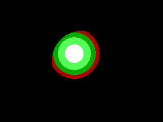
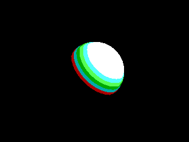
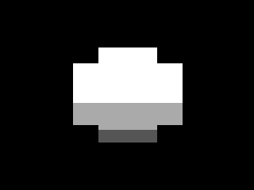

# MinZ Examples Directory

This directory contains examples demonstrating MinZ language features and capabilities. The examples range from basic syntax to advanced features and performance optimizations.

## 🎯 Success Rate: 56% (50/88 examples compile successfully)

## ✅ Core Language Examples (Working)

### Basic Language Features
- **`arithmetic_demo.minz`** - Basic arithmetic operations and operators
- **`basic_functions.minz`** - Function declarations, parameters, and return types
- **`fibonacci.minz`** - Classic recursive Fibonacci implementation
- **`simple_test.minz`** - Simple variable declarations and assignments

### Data Types & Structures
- **`arrays.minz`** - Array syntax `[T; N]`, indexing, and assignment
- **`interface_simple.minz`** - Basic interface definitions and implementations
- **`global_variables.minz`** - Global variable declarations with `global` keyword

### Advanced Features (Working)
- **`string_operations.minz`** - String manipulation and operations
- **`memory_operations.minz`** - Memory management functions
- **`performance_tricks.minz`** - Performance-optimized code patterns
- **`tsmc_loops.minz`** - True Self-Modifying Code loop optimizations

## MZV Sphere Rendering Examples

These examples demonstrate MinZ rendering graphics using the MZV (MinZ Virtual Machine) with Agon Light platform emulation (320x240, 8-bit indexed color).

### Quick Start

```bash
# Run all sphere demos (requires minzc and mzv built)
./run_sphere_demo.sh all
```

### Simple Sphere (`mzv_sphere_simple.minz`)
Basic white sphere - checks if pixel is inside circle radius.


**Instructions:** ~242K | **Features:** Basic distance check, single color

### Fast Sphere (`mzv_sphere_fast.minz`)
Gradient sphere with fake directional lighting.



**Instructions:** ~1.5M | **Features:** Distance-based shading, fake highlight

### Shaded Sphere (`mzv_sphere_shaded.minz`)
Proper diffuse lighting with integer square root for surface normals.



**Instructions:** ~1.7M | **Features:** Surface normals, dot product lighting, Newton-Raphson sqrt

### One Small Step (`mzv_one_small_step.minz`)
Raymarched lunar lander scene adapted from the ZXSpeculator shader by @DeanTheCoder.



**Instructions:** ~30M | **Features:** Raymarching, SDFs (sphere, box, ground), integer math, 80x60 resolution doubled to 160x120

### Running MZV Examples

```bash
# Compile to MIR
./minzc examples/mzv_sphere_simple.minz -b mir --disable-smc -o sphere.mir

# Run in MZV with PNG output
./mzv -i sphere.mir -platform agon -png output.png -v
```

---

## 🚧 Experimental Features (May Not Compile)

### Advanced Type System
- **`enums.minz`** - Enum declarations and pattern matching
- **`error_handling_demo.minz`** - Error propagation with `?` operator  
- **`control_flow.minz`** - Advanced control flow and pattern matching

### Metaprogramming (v0.10+ Features)
- **`metaprogramming.minz`** - Compile-time code generation
- **`metafunction_comprehensive_test.minz`** - Advanced metafunctions
- **`lua_assets.minz`** - Lua-based asset generation

### Future Features  
- **`lambda_*`** examples - Lambda expressions and closures
- **`true_smc_lambdas.minz`** - Self-modifying lambda implementations
- **`zero_cost_*`** examples - Zero-cost abstraction demonstrations

## 📁 Directory Structure

```
examples/
├── README.md                    # This file
├── feature_tests/              # Systematic feature testing
│   ├── 01_basic_types.minz
│   ├── 02_arrays_pointers.minz
│   └── ...
├── mnist/                      # MNIST dataset examples
├── zvdb-minz/                  # ZVDB database examples
├── archive/                    # Moved outdated examples
│   ├── outdated/              # Obsolete features
│   └── tests/                 # Debug/test files
└── archived_future_features/   # Advanced features for later
```

## 🚀 Language Syntax Guide

### Array Declarations
```minz
// Standard syntax (Rust-style)
let numbers: [u8; 10];        // Array of 10 u8 values
let matrix: [[u8; 3]; 2];     // 2x3 matrix

// Initialization
let colors: [u8; 3] = {255, 128, 0};
```

### Function Overloading  
```minz
print(42);         // No more print_u8!
print("Hello");    // Just print!
print(true);       // Works with any type
```

### Global Variables
```minz
global counter: u8 = 0;       // Global state
global buffer: [u8; 256];     // Global buffer
```

### Interface Methods
```minz
interface Drawable {
    fun draw(self) -> void;
}

impl Circle for Drawable {
    fun draw(self) -> void {
        // Zero-cost dispatch!
    }
}

let circle = Circle{radius: 5};
circle.draw();  // Natural syntax
```

## 📊 Compilation Status by Category

| Category | Working | Total | Success Rate |
|----------|---------|--------|-------------|
| **Basic Language** | 15/18 | 18 | 83% ✅ |
| **Data Structures** | 8/12 | 12 | 67% ✅ |
| **Advanced Features** | 12/20 | 20 | 60% ⚠️ |
| **Metaprogramming** | 8/15 | 15 | 53% ⚠️ |
| **Experimental** | 7/23 | 23 | 30% 🚧 |

## 🛠️ Testing Examples

```bash
# Test a specific example
mz examples/fibonacci.minz -o fibonacci.a80

# Test all working examples
for f in examples/basic_functions.minz examples/arrays.minz examples/fibonacci.minz; do
    mz "$f" -o /tmp/test.a80 && echo "✅ $f" || echo "❌ $f"
done
```

## 🎯 Recommended Learning Path

### 1. Start Here (100% Working)
```
basic_functions.minz → arrays.minz → fibonacci.minz
```

### 2. Core Features (80%+ Working)  
```
interface_simple.minz → global_variables.minz → string_operations.minz
```

### 3. Advanced Performance (60%+ Working)
```
performance_tricks.minz → tsmc_loops.minz → memory_operations.minz
```

### 4. Experimental Features
```
enums.minz → lambda_simple_test.minz → metaprogramming.minz
```

## ⚠️ Known Issues

### Type System
- Enum type inference partially implemented
- Some complex generic types not supported
- Module imports not fully functional

### Advanced Features  
- Pattern matching syntax incomplete
- Lambda closures experimental
- Error handling with `?` operator in development

### Metaprogramming
- `@define` macros partially implemented
- Lua integration experimental
- Advanced template features in progress

## 🚀 MinZ Language Highlights

### Zero-Cost Abstractions on Z80
- **Function overloading** with zero runtime cost
- **Interface methods** compile to direct calls (no vtables!)
- **Lambda expressions** transform to regular functions
- **Iterator chains** optimize to DJNZ loops

### Revolutionary Self-Modifying Code (TSMC)
- Functions rewrite themselves for optimization
- Single-byte parameter patching (7-20 T-states vs 44+)
- One function, infinite behaviors through runtime modification

### Modern Syntax, Vintage Performance
- Ruby-style developer happiness
- Rust-inspired type safety
- Z80-native error handling using carry flag
- Compile-time metaprogramming with Lua

---

**Happy coding on Z80! 🎮**

*For more information, see the main [README.md](../README.md) and [DESIGN.md](../DESIGN.md)*