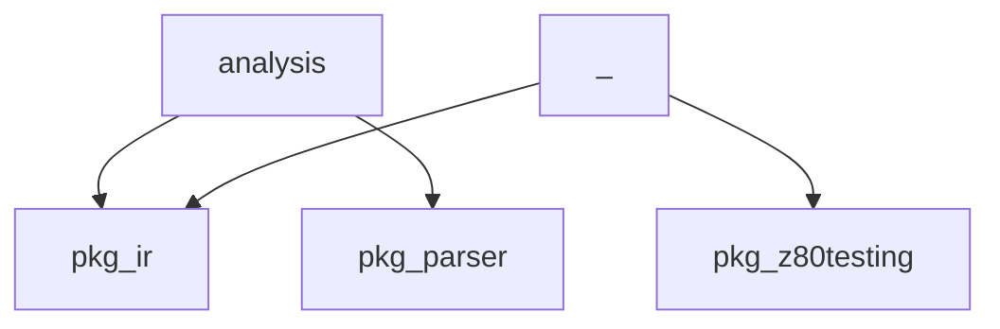

# MinZ Compiler Static Analysis Report

Analyzing Go codebase structure...

## Package Structure

### . (main)
- Files: 3
- Functions: 25 (Exported: 5)
- Types: 6

### analysis (main)
- Files: 8
- Functions: 7 (Exported: 0)
- Types: 2

## Import Dependency Graph

## Dead Code Analysis

### Potentially Dead Functions
These functions are never called and not exported:
- `..printImportGraph`
- `analysis.calculateImprovements`
- `..printCallGraphSummary`
- `..analyzeCallGraph`
- `..printDeadCode`
- `..printCoreComponents`
- `analysis.generateReport`
- `analysis.createDashboard`
- `..printPackageStructure`
- `..analyzeFile`

## Core Components

## Call Graph Summary

### Most Referenced Functions
- `formatNumber`: 4 references
- `formatCycles`: 4 references
- `generateBar`: 2 references
- `formatCategory`: 2 references
- `truncate`: 2 references
- `countExported`: 1 references
- `generateMarkdownReport`: 1 references
- `NewARCHBackend`: 1 references
- `runBenchmarks`: 1 references
- `saveReportToFile`: 1 references
