# MinZ Compiler Architecture Guide

## Overview

This document provides a comprehensive view of the MinZ compiler architecture,
including package structure, dependencies, and build system.

## Compilation Pipeline

```
┌─────────────┐     ┌─────────────┐     ┌──────────────┐     ┌─────────────┐
│ .minz files │ --> │   Parser    │ --> │   Semantic   │ --> │     IR      │
│             │     │(tree-sitter)│     │   Analysis   │     │             │
└─────────────┘     └─────────────┘     └──────────────┘     └─────────────┘
                           |                    |                     |
                      pkg/parser           pkg/semantic          pkg/ir

┌─────────────┐     ┌─────────────┐     ┌──────────────┐
│     IR      │ --> │  Optimizer  │ --> │   Codegen    │ --> [.a80/.c/.ll/.wat]
│             │     │   Passes    │     │  (Backend)   │
└─────────────┘     └─────────────┘     └──────────────┘
                      pkg/optimizer       pkg/codegen/*
```

## Package Structure

### pkg/ast
**Purpose**: Abstract Syntax Tree definitions
**Files**: 3

### pkg/parser
**Purpose**: Tree-sitter based parser integration
**Files**: 3
**Key Exports**: NewSimpleParser, New

### pkg/semantic
**Purpose**: Semantic analysis and type checking
**Files**: 13
**Key Exports**: NewTemplateExpander, NewInterfaceMonomorphizer, NewAnalyzer, GenerateErrorPropagation, GenerateErrorReturn

### pkg/ir
**Purpose**: Intermediate Representation (MIR)
**Files**: 1
**Key Exports**: NewFunction, NewModule

### pkg/optimizer
**Purpose**: Optimization passes and transformations
**Files**: 25
**Key Exports**: NewPeepholeOptimizationPass, NewMIRReorderingPass, NewASMReorderingPass, GetRegisterName, NewZ80InstructionSelectionPass

### pkg/codegen
**Purpose**: Backend code generators
**Files**: 21
**Key Exports**: NewZ80RegisterAllocator, NewBackendToolkit, NewBaseGenerator, NewBackendBuilder, RegisterBackend

## Backend Architecture

### Available Backends
- **base**: Code generation backend
- **c**: C code generation
- **example**: Code generation backend
- **gb**: Game Boy assembly (modified Z80)
- **i8080**: Intel 8080 assembly
- **llvm**: LLVM IR generation
- **m6502**: Code generation backend
- **m68k**: Motorola 68000 assembly
- **wasm**: WebAssembly text format
- **z80**: Z80 assembly (default, production)

## Build System

### Tool Dependency Graph

```mermaid
graph TD
    create_backend_sh --> create_backend_sh
    Makefile --> generate_performance_report_go
    comprehensive_analysis_sh --> minzc
    build_release_v0_9_7_sh --> minzc
    run_tsmc_benchmarks_sh --> minzc
    create_backend_sh --> minzc
    comprehensive_backend_test_sh --> minzc
    test_all_backends_sh --> minzc
    run_e2e_tests_sh --> minzc
    prepare_release_sh --> minzc
    test_detailed_analysis_sh --> minzc
    test_e2e_comprehensive_sh --> minzc
    comprehensive_test_all_sh --> minzc
    test_suite_sh --> minzc
    compile_all_examples_sh --> minzc
    install_sh --> minzc
    test_backend_e2e_sh --> minzc
    analyze_failures_sh --> minzc
    test_all_sh --> minzc
    test_debug_sh --> minzc
    debug_parse_inline_asm_sh --> minzc
    test_representative_examples_sh --> minzc
    validate_true_smc_sh --> minzc
    comprehensive_test_sh --> minzc
    test_all_examples_sh --> minzc
    test_c_backend_all_sh --> minzc
    compile_optimized_examples_sh --> minzc
```


### Script Types
- **shell**: 28 scripts
  - analyze_failures.sh
  - build_release_v0.9.7.sh
  - compile_all_examples.sh
  - compile_optimized_examples.sh
  - comprehensive_analysis.sh
  - ... and 23 more
- **python**: 4 scripts
  - analyze_dependencies.py
  - analyze_example.py
  - generate_corpus_tests.py
  - score_true_smc.py
- **make**: 1 scripts
  - Makefile

## Key Components

### Entry Points
- `cmd/minzc/main.go` - Main compiler executable
- `cmd/repl/main.go` - Interactive REPL
- `cmd/backend-info/main.go` - Backend information tool

### Core Types
- `ast.Node` - AST node interface
- `ir.Instruction` - IR instruction
- `ir.Function` - IR function representation
- `ir.Module` - Complete IR module

### Key Interfaces
- `ast.Expression` - Expression AST nodes
- `ast.Statement` - Statement AST nodes
- `ir.Type` - Type system interface
- `codegen.Backend` - Backend code generator interface

