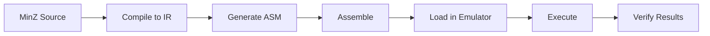

# Article 050: MinZ Multi-Backend Architecture Strategy - Design for Multiple Targets

**Author:** Claude Code Assistant  
**Date:** July 31, 2025  
**Version:** MinZ v0.6.0+  
**Status:** ARCHITECTURAL DESIGN PROPOSAL 🏗️

## Executive Summary

This document analyzes the best approach for implementing multi-backend support in MinZ (Z80, 6502, 6809, etc.) and establishing comprehensive testing infrastructure. We explore three architectural approaches and recommend a hybrid strategy that balances immediate needs with long-term maintainability.

**Key Finding:** We already have Z80 emulator infrastructure (`remogatto/z80`) but need to establish proper end-to-end testing before expanding to new targets.

## 1. Current State Analysis

### 1.1 What We Have

**Code Generation:**
```go
// Current: Direct Z80 generation
generator := codegen.NewZ80Generator(outFile)
generator.Generate(irModule)
```

**Testing Infrastructure:**
```go
// Existing: Z80 emulator test framework
type TestContext struct {
    cpu    *z80.Z80         // remogatto/z80 emulator
    memory *TestMemory      // Memory tracking
    ports  *TestPorts       // I/O tracking
}

// DSL for testing
test.Given().Register("A", 0x42).Memory(0x8000, 0x3E, 0x42)
test.When().Execute(10)
test.Then().Register("A", 0x42).Flag("Z", false)
```

**Problems:**
- No interface abstraction for code generators
- Z80-specific code throughout codegen package
- Test framework exists but not used for compiler output
- No end-to-end testing of MinZ programs

### 1.2 Multi-Backend Requirements

1. **Clean separation** of target-specific code
2. **Shared optimization passes** where applicable
3. **Target-specific optimizations** (TSMC, DJNZ, etc.)
4. **Unified testing approach** across all targets
5. **Incremental development** without breaking Z80

## 2. Architectural Approaches

### 2.1 Approach A: Separate Projects

```
minz-z80/     (current)
minz-6502/    (new repo)
minz-6809/    (new repo)
minz-core/    (shared code)
```

**Pros:**
- Complete isolation
- Can experiment freely
- No risk to Z80 code

**Cons:**
- Code duplication
- Maintenance nightmare
- Difficult to share improvements
- Community fragmentation

**Verdict: ❌ Not Recommended**

### 2.2 Approach B: Branch-Based Development

```
main          (Z80 stable)
feature/6502  (6502 development)
feature/6809  (6809 development)
```

**Pros:**
- Easy to start
- Can merge when ready
- Shared history

**Cons:**
- Merge conflicts inevitable
- Hard to test multiple targets
- Branches diverge quickly
- CI/CD complexity

**Verdict: ⚠️ Okay for Experimentation**

### 2.3 Approach C: Interface-Based Multi-Backend (Recommended)

```go
// codegen/interface.go
type CodeGenerator interface {
    Generate(module *ir.Module) error
    SupportsFeature(feature string) bool
}

// codegen/z80/generator.go
type Z80Generator struct { ... }

// codegen/m6502/generator.go  
type M6502Generator struct { ... }

// Factory pattern
func NewGenerator(target string, w io.Writer) CodeGenerator {
    switch target {
    case "z80":
        return z80.NewGenerator(w)
    case "6502":
        return m6502.NewGenerator(w)
    default:
        return nil
    }
}
```

**Pros:**
- Clean architecture
- Easy to add targets
- Shared optimization infrastructure
- Single codebase
- Unified testing

**Cons:**
- Refactoring needed
- Initial complexity

**Verdict: ✅ Recommended**

## 3. Testing Infrastructure Design

### 3.1 Current Testing Gaps

1. **No end-to-end tests** - Compiler output never executed
2. **No regression tests** - Changes could break existing code
3. **No performance tests** - Can't verify optimization claims
4. **No hardware tests** - Never tested on real Z80

### 3.2 Proposed Testing Layers

#### Layer 1: Unit Tests (Existing)
```go
// Test individual compiler components
func TestRegisterAllocator(t *testing.T) { ... }
func TestPeepholeOptimizer(t *testing.T) { ... }
```

#### Layer 2: Integration Tests (New)
```go
// Test compiler pipeline
func TestCompileSimpleProgram(t *testing.T) {
    source := `fun main() -> void { let x = 42; }`
    ir := compile(source)
    asm := generate(ir)
    assert(asm.Contains("LD A, 42"))
}
```

#### Layer 3: Emulator Tests (Enhance Existing)
```go
// Test generated code execution
func TestGeneratedCode(t *testing.T) {
    // Compile MinZ program
    asm := compileMinZ("test.minz")
    
    // Assemble to binary
    binary := assemble(asm)
    
    // Load and execute in emulator
    test := NewMinZTest(t)
    test.LoadBinary(0x8000, binary)
    test.When().Call(0x8000)
    test.Then().Register("A", 42)
}
```

#### Layer 4: Cross-Target Tests (New)
```go
// Same test runs on all targets
func TestCrossTarget(t *testing.T) {
    source := `fun add(a: u8, b: u8) -> u8 { return a + b; }`
    
    for _, target := range []string{"z80", "6502", "6809"} {
        t.Run(target, func(t *testing.T) {
            asm := compile(source, target)
            result := emulate(target, asm, 10, 20)
            assert(result == 30)
        })
    }
}
```

### 3.3 Testing Tools Integration

**For Z80:**
- ✅ Have: `remogatto/z80` emulator
- Need: Z80 assembler integration (sjasmplus)
- Need: Symbol table loader

**For 6502:**
- Need: 6502 emulator (Go package exists: github.com/fogleman/nes)
- Need: 6502 assembler integration (ca65)
- Need: Test framework similar to Z80

**For 6809:**
- Need: 6809 emulator (fewer Go options)
- Need: 6809 assembler integration
- Need: Test framework

## 4. Implementation Roadmap

### Phase 0: Establish Z80 Testing (1-2 weeks) 🚨 **DO THIS FIRST**

Before adding any new backend:

1. **Create end-to-end test suite**
   ```go
   // tests/e2e/basic_test.go
   func TestHelloWorld(t *testing.T) {
       compileAndRun(t, "examples/hello.minz")
       expectOutput("Hello, World!")
   }
   ```

2. **Integrate assembler**
   ```go
   // tools/assembler.go
   func AssembleZ80(asmFile string) ([]byte, error) {
       // Call sjasmplus
       cmd := exec.Command("sjasmplus", asmFile)
       return cmd.Output()
   }
   ```

3. **Create test harness**
   ```go
   // testing/harness.go
   type TestHarness struct {
       compiler *Compiler
       assembler Assembler
       emulator Emulator
   }
   ```

4. **Verify TSMC claims**
   ```go
   func TestTSMCPerformance(t *testing.T) {
       traditional := measureCycles("traditional_call.minz")
       tsmc := measureCycles("tsmc_call.minz")
       assert(tsmc < traditional * 0.7) // 30% improvement
   }
   ```

### Phase 1: Refactor for Multi-Backend (2-3 weeks)

1. **Extract interface**
   ```go
   type CodeGenerator interface {
       Generate(module *ir.Module) error
       GetTargetInfo() TargetInfo
   }
   ```

2. **Move Z80 to subdirectory**
   ```
   codegen/
     interface.go
     common.go
     z80/
       generator.go
       registers.go
       tsmc.go
   ```

3. **Add target selection**
   ```go
   // cmd/minzc/main.go
   flag.StringVar(&target, "target", "z80", "Target architecture")
   ```

### Phase 2: Implement 6502 Backend (3-4 months)

1. **Create basic structure**
   ```
   codegen/
     m6502/
       generator.go
       registers.go
       addressing.go
   ```

2. **Implement incrementally**
   - Basic instructions first
   - Add TSMC support
   - Optimize addressing modes
   - Platform-specific features

3. **Test continuously**
   - Every feature tested against emulator
   - Compare with Z80 results
   - Performance benchmarks

### Phase 3: Testing Infrastructure Evolution

1. **Automated test generation**
   ```go
   // Generate tests from MinZ examples
   func generateTests(dir string) {
       for each .minz file {
           create test case
           compile for all targets
           verify same behavior
       }
   }
   ```

2. **Performance regression tests**
   ```go
   // Track performance over time
   func BenchmarkTSMC(b *testing.B) {
       for each target {
           measure cycles
           compare with baseline
           alert if regression
       }
   }
   ```

3. **Hardware testing framework**
   ```go
   // For brave souls with real hardware
   type HardwareTest interface {
       Upload(binary []byte) error
       Execute() error
       ReadOutput() (string, error)
   }
   ```

## 5. Critical Decision Points

### 5.1 When to Start Multi-Backend?

**Start multi-backend ONLY after:**
- ✅ Z80 end-to-end tests passing
- ✅ TSMC performance verified
- ✅ Major Z80 bugs fixed
- ✅ Test infrastructure solid

**Current status: ❌ NOT READY**
- Need end-to-end tests first
- Never tested generated code
- TSMC performance unverified

### 5.2 Branch Strategy for Experimentation

**Recommended approach:**
```bash
# For initial 6502 exploration
git checkout -b experiment/6502-codegen

# For testing multi-backend refactor
git checkout -b feature/multi-backend-interface

# Keep main stable with Z80
```

### 5.3 Migration Strategy

1. **Start with interface extraction** (low risk)
2. **Test thoroughly on Z80** (no behavior change)
3. **Create 6502 skeleton** (separate directory)
4. **Implement incrementally** (basic → advanced)
5. **Merge when stable** (extensive testing)

## 6. Testing Infrastructure Recommendations

### 6.1 Immediate Actions (Do First!)

1. **Create `tests/e2e/` directory**
   ```go
   // Simple end-to-end test
   func TestBasicProgram(t *testing.T) {
       src := `fun main() -> void { @asm("LD A, 42"); }`
       binary := CompileAndAssemble(t, src)
       
       emu := NewZ80Emulator()
       emu.LoadAt(0x8000, binary)
       emu.Run(0x8000)
       
       assert.Equal(t, 42, emu.RegA())
   }
   ```

2. **Add assembler integration**
   ```bash
   # Install sjasmplus
   brew install sjasmplus  # or equivalent
   
   # Add to test scripts
   sjasmplus output.a80 -o output.bin
   ```

3. **Create test corpus**
   ```
   tests/corpus/
     basic/
       arithmetic.minz
       functions.minz
       loops.minz
     tsmc/
       simple_tsmc.minz
       recursive_tsmc.minz
     regression/
       issue_001.minz
       issue_002.minz
   ```

### 6.2 Emulator Integration Pattern

```go
// testing/emulator_factory.go
type EmulatorFactory struct {
    emulators map[string]func() Emulator
}

func (f *EmulatorFactory) Register(target string, creator func() Emulator) {
    f.emulators[target] = creator
}

func (f *EmulatorFactory) Create(target string) Emulator {
    if creator, ok := f.emulators[target]; ok {
        return creator()
    }
    return nil
}

// Register emulators
factory.Register("z80", func() Emulator {
    return &Z80Emulator{cpu: z80.New()}
})

factory.Register("6502", func() Emulator {
    return &M6502Emulator{cpu: m6502.New()}
})
```

### 6.3 Test Execution Flow



## 7. Existing Z80 Testing Assets

### 7.1 What We Have

```go
// pkg/testing/z80_test_framework.go
- Z80 emulator wrapper (remogatto/z80)
- Memory/IO tracking
- Given/When/Then DSL
- Cycle counting

// pkg/testing/minz_integration.go  
- A80 file loader (partial)
- Symbol table support (stub)
- Source mapping (stub)
```

### 7.2 What's Missing

1. **Assembler integration** - Can't convert .a80 to binary
2. **Symbol resolution** - Can't find function addresses
3. **Runtime support** - Print functions, etc.
4. **Test runner** - Automated test execution
5. **Coverage tracking** - What code was tested?

### 7.3 Quick Wins

1. **Use existing test framework**
   ```go
   func TestExistingFramework(t *testing.T) {
       test := NewTest(t)
       test.Given().
           Code(0x8000, 0x3E, 0x42). // LD A, 42
           Register("PC", 0x8000)
       test.When().Execute(4)
       test.Then().Register("A", 0x42)
   }
   ```

2. **Add MinZ test helper**
   ```go
   func CompileAndTest(t *testing.T, source string) *MinZTest {
       // Compile source
       // Assemble output
       // Load in emulator
       // Return test context
   }
   ```

## 8. Architecture Recommendations

### 8.1 Directory Structure

```
minzc/
  cmd/minzc/
    main.go           # CLI with --target flag
  pkg/
    ir/               # Shared IR (unchanged)
    codegen/
      interface.go    # CodeGenerator interface
      common.go       # Shared utilities
      factory.go      # Generator factory
      z80/           # Z80 backend
        generator.go
        registers.go
        tsmc.go
        optimizer.go
      m6502/         # 6502 backend (future)
        generator.go
        registers.go
        tsmc.go
        zeropage.go
    testing/
      framework.go    # Enhanced test framework
      emulators/     
        z80.go       # Z80 emulator wrapper
        m6502.go     # 6502 emulator wrapper
      harness.go     # Test harness
  tests/
    unit/            # Unit tests
    integration/     # Integration tests
    e2e/            # End-to-end tests
      z80/          # Z80-specific tests
      m6502/        # 6502-specific tests
      common/       # Cross-platform tests
    corpus/         # Test programs
    benchmarks/     # Performance tests
```

### 8.2 Interface Design

```go
// codegen/interface.go
package codegen

type CodeGenerator interface {
    // Core generation
    Generate(module *ir.Module) error
    
    // Target information
    GetTarget() TargetInfo
    SupportsFeature(feature Feature) bool
    
    // Configuration
    SetOption(key string, value interface{})
    EnableOptimization(opt Optimization)
}

type TargetInfo struct {
    Name            string
    Architecture    string
    WordSize        int
    Endianness      Endianness
    RegisterCount   int
    HasTSMC         bool
}

type Feature string
const (
    FeatureTSMC         Feature = "tsmc"
    FeatureShadowRegs   Feature = "shadow_registers"
    FeatureIndexedAddr  Feature = "indexed_addressing"
)

type Optimization string
const (
    OptTSMC          Optimization = "tsmc"
    OptPeephole      Optimization = "peephole"
    OptRegisterAlloc Optimization = "register_alloc"
)
```

### 8.3 Generator Implementation Pattern

```go
// codegen/z80/generator.go
package z80

type Generator struct {
    *codegen.BaseGenerator  // Shared functionality
    regAlloc   *RegisterAllocator
    enableTSMC bool
}

func (g *Generator) Generate(module *ir.Module) error {
    // Z80-specific generation
    g.EmitHeader()
    
    for _, fn := range module.Functions {
        if g.enableTSMC && fn.CanUseTSMC() {
            g.generateTSMCFunction(fn)
        } else {
            g.generateStandardFunction(fn)
        }
    }
    
    g.EmitFooter()
    return nil
}

func (g *Generator) SupportsFeature(f codegen.Feature) bool {
    switch f {
    case codegen.FeatureTSMC:
        return true
    case codegen.FeatureShadowRegs:
        return true
    default:
        return false
    }
}
```

## 9. Risk Mitigation

### 9.1 Risks of Multi-Backend Too Early

1. **Z80 bugs propagated** to all backends
2. **Testing debt** multiplied by targets
3. **Feature creep** before basics work
4. **Community confusion** about stability

### 9.2 Mitigation Strategy

1. **Establish Z80 baseline first**
   - 100% test coverage of examples
   - Performance benchmarks verified
   - Major bugs fixed

2. **Create backend interface carefully**
   - Review with examples
   - Test with Z80 first
   - Document thoroughly

3. **Add backends incrementally**
   - 6502 first (most research done)
   - Basic features before advanced
   - Cross-platform tests from day 1

4. **Maintain stability guarantees**
   - Z80 always stable on main
   - New backends in beta
   - Clear documentation of support level

## 10. Recommendations Summary

### 10.1 Immediate Priority: Z80 Testing

**DO THIS FIRST (1-2 weeks):**
1. Integrate sjasmplus assembler
2. Create end-to-end test suite
3. Verify TSMC performance claims
4. Test all examples in emulator
5. Fix any bugs found

### 10.2 Architecture Preparation (2-3 weeks)

**After testing established:**
1. Extract CodeGenerator interface
2. Refactor Z80 to use interface
3. Create generator factory
4. Add --target flag to CLI
5. Ensure Z80 still works perfectly

### 10.3 6502 Implementation (3-4 months)

**Only after above complete:**
1. Create m6502 package structure
2. Implement basic generation
3. Add TSMC support
4. Create 6502 test suite
5. Cross-platform test validation

### 10.4 Testing Philosophy

**Every feature must be:**
- Unit tested (component level)
- Integration tested (pipeline level)
- Emulator tested (execution level)
- Benchmark tested (performance level)
- Cross-platform tested (consistency level)

## 11. Conclusion

The path to multi-backend support is clear but requires discipline:

1. **Fix the foundation first** - Z80 must be rock solid
2. **Test everything** - No untested code in main
3. **Refactor carefully** - Interface design is critical
4. **Implement incrementally** - Basic before advanced
5. **Maintain quality** - Better one good backend than three broken ones

The existing test framework (`remogatto/z80`) provides a solid foundation, but we need to build the missing pieces before expanding to new architectures.

**Next Steps:**
1. Set up Z80 end-to-end testing
2. Verify all optimization claims
3. Only then consider multi-backend refactoring

---

*Success in multi-backend support comes from a solid foundation, not from rushing to implement new targets. Test first, refactor second, expand third.*