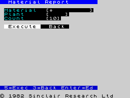

# Report #094 — Week In Review: The Everything Sprint

**Period:** 2026-03-11 → 2026-03-18
**Stats:** 253 commits, 553 files changed, +136,709 lines, 3 parallel sessions

---

## The Numbers

| Metric | Value |
|--------|-------|
| Commits (master) | 253 |
| Files changed | 553 |
| Lines added | 136,709 |
| New frontends | +1 (ABAP, now 8 total) |
| New backends | +1 experimental (LIR/WFC on `feat/lir-backend`) |
| New stdlib modules | 4 (tui/widget, tui/render, tui/screen, fs/fat12) |
| New tools | mzn (native compiler via QBE/C99) |
| Bug fixes | 27 |
| Reports written | 21 (#073 → #093) |

---

## 1. Eight Frontends, One Pipeline

All eight languages now compile through a single HIR → MIR2 → Z80 pipeline:

```
Nanz (.nanz)   ──┐
C89/ObjC (.c)  ──┤
PL/M-80 (.plm) ──┤
Lanz (.lanz)   ──┼──→ HIR ──→ MIR2 ──→ Z80 / QBE / C99 / 6502
Lizp (.lizp)   ──┤
Pascal (.pas)  ──┤
ABAP (.abap)   ──┤
HIR (.hir)     ──┘
```

**ABAP** was the week's biggest frontend addition — parsing via embedded Wasm blob (14MB `@abaplint/core`, no Node.js needed), with PARAMETERS selection screen, FORM subroutines, OOP, and SQLite integration. ABAP Hello World compiles to 38 bytes of Z80 for ZX Spectrum.

**ObjC** got dynamic dispatch via `@protocol` vtables and a canvas rendering library. Plasma, diamond, and XOR demoscene effects compile to both native (QBE/C99) and Z80.

### Frontends at a Glance

| Frontend | Files | Asserts | Highlight |
|----------|-------|---------|-----------|
| Nanz | 95+ | 87+ | Tetris, NC, FAT12, TUI, metafunctions |
| C89/ObjC | 16 | 350+ | FatFS R0.16, plasma renderer, do-while |
| PL/M-80 | 26 | 100% | Intel 8080 Tools corpus |
| ABAP | 13 | 13/13 MZV | Wasm parser, selection screen, SQLite |
| Pascal | 6 | — | Function pointers |
| Lanz | 16 tests | — | S-expression interchange format |
| Lizp | 24 tests | — | Lisp-like syntax |

---

## 2. Three Native Backends

### Z80 (Production)
The primary target. 71/73 core examples compile. SDCC comparison shows **MinZ −55% code size** on identical C source (81B vs 179B for 8 benchmark functions).

### QBE + C99 (Correctness Oracles)
Both backends received major fixes this week:

- **mir2qbe:** ARM64 pointer store/load fix (`storel`/`loadl` for 64-bit values), `@` symbol sanitization, string pool emission
- **mir2c:** alloca register declaration fix, extern function forward declarations, `void main()` → `int main()`, symbol sanitization

**Result:** ObjC plasma compiles and runs natively on both. QBE binary: 52KB, C99 binary: 35KB.

### LIR (Experimental, `feat/lir-backend`)
A constraint-driven backend using **Wave Function Collapse** for register allocation:

- **948/948 functions** across 4 frontends (C89, PL/M, Nanz, Lizp) — 100% coverage
- WFC collapses register options per-instruction with constraint propagation
- PBQP→WFC hint bridge for guided allocation
- Inter-block constraint propagation with multi-block assembly emission
- Tail call optimization (CALL+RET → JP)
- ADR-0033, ADR-0034 architecture documents

---

## 3. FAT12/16 Filesystem

A complete read-write FAT filesystem library written in idiomatic Nanz (`stdlib/fs/fat12.minz`, 541 LOC):

**Operations:** mount, find, read, create, delete, overwrite, cluster chain traversal

**Verification:** 5-channel cross-verification pipeline:
1. Nanz writes FAT image → Nanz VM reads back
2. Fresh Nanz VM reads (no state carryover)
3. gcc-compiled FatFS R0.16 reads (gold standard)
4. C89 MIR2 VM reads
5. Raw byte inspection

**MIR2 comparison** (Nanz vs C89, instruction count):

| Function | Nanz | C89 | Winner |
|----------|------|-----|--------|
| ld_word | 9 | 9 | TIE |
| sfn_checksum | 18 | 19 | Nanz (no C int promotion) |
| st_word | 10 | 8 | C89 (trunc vs mask) |
| chain_length | 36 | 35 | C89 (break vs flag) |

6 TIE, 2 Nanz wins, 2 C89 wins — essentially identical code quality from two independent frontends.

---

## 4. TUI Framework — Three Levels

A universal terminal UI framework that runs on CP/M, ZX Spectrum, and MZV:

### Level 1: Flat API
```nanz
sel_register_str(c"Name", c"World")
sel_show()  // returns 1 (host handled) or 0 (Z80 fallback)
```

### Level 2: OOP UFCS
```nanz
var scr: Screen
scr.init(c"Material Report")
scr.add_field(c"Material", c"Steel")
scr.add_int(c"Count", 10)
scr.add_button(c"Execute")
scr.show()
```

### Level 3: Compile-Time Metafunction
```nanz
@screen("Material Report") {
    field "Material"
    field "Plant"
    button "Execute"
}
```

The `@screen` metafunction runs on the MIR2 VM at compile time, iterates the block AST, and emits Nanz source code via `emit()`. Lisp-style macros with normal syntax, written in the language itself.

**Platform support:**

| Platform | Method | Binary Size |
|----------|--------|-------------|
| CP/M | VT100 escape sequences via BDOS | 735 bytes |
| ZX Spectrum | RST $10 ROM codes (INK/PAPER/AT) | 603 bytes |
| MZV (VM) | ANSI host functions | — |

---

## 5. Mini Norton Commander

A working single-panel file browser in 474 lines of Nanz:

- Mounts FAT12/16 disk images
- Directory listing with Name/Size/Type columns
- Cursor navigation (arrow keys)
- F3 file viewer (reads file content via cluster chain)
- Info panel (selected file attributes)
- Classic blue Norton Commander aesthetic

```bash
./mzv --disk image.img examples/nanz/nc.nanz
```



---

## 6. Compile-Time Platform Detection

New `@target()` intrinsic returns a compile-time constant:

```nanz
if @target() == 0 {  // CP/M
    asm z80 (in ch) { LD E, A / LD C, 2 / CALL 5 }
}
if @target() == 1 {  // ZX Spectrum
    asm z80 (in ch) { RST 0x10 }
}
```

Values: 0=CP/M, 1=ZX Spectrum, 2=Agon, 3=MZV, 255=generic. The constant folds through MIR2 optimizer — dead branches eliminated by DCE. Same source, different targets, zero runtime cost.

---

## 7. Toolchain Updates

- **VSCode Extension v0.8.0** — all 9 frontends, native compile (C99/QBE) in context menu, ABAP support
- **MZV** — TUI host functions, disk I/O host, ZX/TUI auto-detection, `--zx` / `--disk` flags
- **MZE** — CP/M file I/O, zero page protection, Zork I runs
- **MZN** — canvas C runtime with PNG output, auto-harness for mainless programs, all 8 frontends
- **MZX** — RZX input replay, headless mode, frame dumping

---

## 8. Key Bug Fixes

| Bug | Impact | Fix |
|-----|--------|-----|
| ARM64 `adrp w0` in QBE | ObjC vtables crash on Apple Silicon | `storel`/`loadl` for pointer-width values |
| mir2c alloca undeclared | Struct allocations fail in C99 backend | Emit variable declaration for OpAlloca dst |
| DJNZ `elimJrToRet` | Exit RET eaten after DJNZ loops | Guard peephole against DJNZ fall-through |
| FAT cache offset | Multi-cluster reads corrupt data | Sector-relative offsets (was absolute byte) |
| ABAP string DATA | `WRITE lv_msg` prints nothing | Intern string + assign address at init |
| WriteHeap duplicate | Build failure from merge | Rename to WriteHeapBytes |
| String pool merge | Level 3 @screen fails on emitted strings | `remapStringRefs` after HIR merge |

---

## What's Next

- **NC dual-panel** — second panel, directory navigation, file copy
- **`@target()` in TUI stdlib** — single source for CP/M + ZX Spectrum + Agon
- **LIR merge** — `feat/lir-backend` → master when edge cases resolved
- **Z80 regalloc fixes** — ADR-0006 (u16 operations) blocks NC on CP/M
- **Metafunction expansion** — `@test`, `@derive`, `@sql`, `@route`
