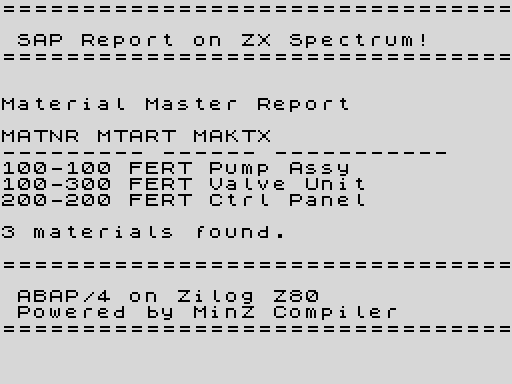

# Report #114: ABAP/4 on ZX Spectrum

**Date:** 2026-03-24
**Special Issue 2.2: ABAP on ZX Spectrum**

---

## The Screenshot



A real `.abap` file. Compiled to Z80. Running on a ZX Spectrum. Rendering readable text with an embedded font. **2KB binary.**

---

## What's New

### 1. ABAP on ZX Spectrum (`--target=spectrum`)

The ABAP runtime now has two output backends:
- **CP/M** (default): BDOS CALL 5 for character output, BDOS 0x0A for input
- **ZX Spectrum**: Embedded 96-char font (768 bytes), direct screen memory writes

The same `.abap` source compiles to both targets. The runtime swap is automatic based on `--target`.

```bash
# CP/M (interactive, with selection screen prompts)
mz sap_hello_zx.abap --target=cpm -o out.a80

# ZX Spectrum (renders to screen memory with ZX font)
mz sap_zx_demo.abap --target=spectrum -o out.a80
```

### 2. ABAP Open SQL Pipeline

Full ABAP OPEN SQL now works on MZV:

```abap
SELECT matnr mtart meins maktx
  FROM mara
  INNER JOIN makt ON mara~matnr = makt~matnr
  WHERE mtart = 'FERT'
  INTO TABLE @DATA(lt_mara).

cl_salv_table=>factory( lt_mara ).
```

Output:
```
matnr               mtart               meins               maktx
--------------------------------------------------------------------------------
100-100             FERT                ST                  Pump Assembly
100-300             FERT                ST                  Valve Unit
200-200             FERT                PC                  Control Panel
3 rows displayed.
```

Features implemented:
- `SELECT ... INTO TABLE @DATA(lt_name)` — inline internal table declaration
- `INNER JOIN` / `LEFT JOIN` with tilde notation (`mara~matnr = makt~matnr`)
- `cl_salv_table=>factory(lt_name)` — ALV grid display with column headers
- `WHERE` / `INTO TABLE` clause order flexibility (ABAP allows both)
- Column disambiguation for JOIN queries (inferred from `*!sql CREATE TABLE`)
- Flat buffer internal tables: compile-time schema from seed SQL pragmas

### 3. Interactive Selection Screen on CP/M

```
P_NAME [SAP User]: Alice
P_COUNT [3]: 5

================================
SAP Report on Z80 Processor!
================================

Hello, Alice!
You requested: 5 repetitions.

  [1] Alice
  [2] Alice
  [3] Alice
  [4] Alice
  [5] Alice

================================
ABAP/4 on Z80. Yes, really.
================================
```

Works correctly on CP/M. Selection screen with PARAMETERS, defaults, typed input, unrolled IF blocks.

### 4. ZX Runtime Architecture

```
_zx_putchar(ch)          ; render 1 char via font lookup
  → _zx_font[ch-32]     ; 8-byte glyph from embedded 768-byte font
  → screen[$4000+addr]   ; write 8 scanlines to ZX display file
  → _zx_cursor++         ; advance row/col

abap_write_str(ptr)      ; loop: _zx_putchar for each byte
abap_write(u16)          ; decimal conversion → _zx_putchar per digit
```

Screen memory address calculation (ZX Spectrum interleaved layout):
```
H = $40 | (row & $18)
L = (row & 7) << 5 | col
scanline N: H + N
```

---

## Reproduce

```bash
cd minzc && go build -o ~/.local/bin/mz ./cmd/minzc \
  && go build -o ~/.local/bin/mza ./cmd/mza \
  && go build -o ~/.local/bin/mze ./cmd/mze

# Compile ABAP → Z80 → binary
mz examples/abap/sap_zx_demo.abap --target=spectrum -o /tmp/sap.a80
mza /tmp/sap.a80 -o /tmp/sap.bin

# Run + capture screen memory
mze /tmp/sap.bin -t spectrum --profile /tmp/zx.json

# Render to PNG
pip install Pillow
python3 tools/render_zx_screen.py /tmp/zx.json /tmp/screenshot.png
```

---

## Files Changed

| File | Change |
|------|--------|
| `minzc/pkg/abap/lower.go` | ZX runtime: embedded font, `_zx_putchar`, target-aware `abap_write_str`/`abap_write` |
| `minzc/pkg/abap/lower.go` | Open SQL: `INTO TABLE @DATA()`, `INNER JOIN`, `cl_salv_table`, column disambiguation |
| `minzc/pkg/abap/parse.go` | Parser: `@DATA()` tokens, `INNER JOIN`, `WHERE`/`INTO` order flexibility |
| `minzc/pkg/abap/ast.go` | AST: `IntoTable`, `JoinClause`, `ALVDisplayStmt` |
| `minzc/cmd/mzv/main.go` | MZV: `_itab_slot_*`, `_itab_print_*` host functions, `VM.GlobalAddr()` |
| `minzc/cmd/minzc/main.go` | Pass target to `abap.Compile()` |
| `tools/render_zx_screen.py` | ZX screen renderer (profile JSON → PNG) |
| `examples/abap/sap_zx_demo.abap` | SAP Material Master for ZX Spectrum |
| `examples/abap/mara_alv.abap` | Open SQL + JOIN + ALV demo |
| `examples/abap/sap_calculator.abap` | Interactive calculator on CP/M |
| `examples/abap/sap_hello_zx.abap` | Selection screen + repetitions on CP/M |

---

## Known Limitations

- **ZX Spectrum**: no keyboard input (selection screen prompts hang). Use WRITE-only programs.
- **CP/M**: production regalloc corrupts string pointers in multi-call sequences. Seed SQL and column store use workarounds (hardcoded handles, per-slot asm). ADD/MUL have double-use bug (42+7=84). SUB works correctly.
- **Z80 binary**: `_itab_slot_*` functions use `symbol+offset` expressions — MZA assembles them correctly but Z80-VALIDATE warns.
- **Waiting**: GPU precomputed regalloc table (64/109 functions solved, being wired into pipeline)

---

*ABAP/4 on a 1982 home computer. SAP would be proud. Or horrified.*
