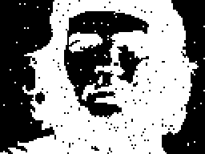
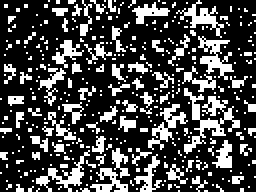

# `che_cascade`: фокусный статус, картинки и план

Дата: 2026-04-04

## Куда смотреть

### 1. Что является target

Главный референс:

- [`/home/alice/dev/gpuforce/data/cascade_seeds_readme.md`](/home/alice/dev/gpuforce/data/cascade_seeds_readme.md)

Там зафиксировано:

- target canvas: `128x96`
- рабочая grid-система: `32x24`
- faithful block sizes: `4x4`, `2x2`, `1x1`
- полная каскадная последовательность: `1171` seed’ов
- полезные snapshots:
  - `21` — coarse layer only
  - `149` — silhouette visible
  - `213` — лицо уже читаемо
  - `1171` — финальный near-perfect render

Важно: для faithful renderer здесь **не** нужен `8x8` block mode. Он понадобится только если специально делать doubled/upscaled display mode на полном ZX `256x192`. Базовый target сейчас именно `128x96`.

### 2. Полный Python render из seed’ов

Смотреть:

- [`python_final.png`](/home/alice/dev/minz-vir/reports/assets/che_cascade/python_final.png)

Это рендер всех seed’ов из `cascade_seeds.json` по описанному в readme алгоритму:

- `lfsr16`
- `make_buf(32x24)`
- `apply_buf(canvas, ox, oy, blk)` с XOR

### 3. Частичный Python render из первых 21 seed’ов

Смотреть:

- [`python_step_21.png`](/home/alice/dev/minz-vir/reports/assets/che_cascade/python_step_21.png)

Это именно та стадия, которую сейчас должен повторять текущий [`che_cascade.nanz`](/home/alice/dev/minz-vir/fun/che_cascade.nanz): только первые `21` coarse seeds.

### 4. Что сейчас получается из Nanz

Смотреть:

- [`nanz_frame_5000.png`](/home/alice/dev/minz-vir/reports/assets/che_cascade/nanz_frame_5000.png)

Это уже не “чёрный кадр из-за attrs”.

Проверено через raw `.scr` dump после `5000` кадров headless-прогона:

- bitmap bytes (`0x4000..0x57FF`): все нули
- attrs были предзагружены белыми (`0x07`)
- значит current Nanz path пока **не рисует bitmap вообще**

Иными словами:

- ранняя проблема с attrs была реальной
- но после принудительной инициализации attrs стало видно, что текущий Nanz renderer ещё и функционально не даёт пикселей

## Что именно мы сейчас повторяем

Текущий [`che_cascade.nanz`](/home/alice/dev/minz-vir/fun/che_cascade.nanz):

- работает только по первым `21` seed’ам
- пытается повторять coarse cascade stage
- рисует на верхнюю левую `128x96` область ZX bitmap

То есть прямо сейчас цель должна быть не “сразу финальный портрет”, а:

1. добиться совпадения с Python `step=21`
2. потом расширить до `213`
3. потом уже идти к полному `1171`

## Что, похоже, не так сейчас

На сегодняшний момент наиболее вероятная practical diagnosis такая:

1. screen/attrs initialization в самом Nanz-файле отсутствует
2. even after external attr preload текущая draw-path логика всё ещё не даёт ненулевой bitmap
3. значит вопрос уже не только в emulator screenshot path, а в самом renderer path

То есть следующий шаг должен быть не “ещё один скриншот”, а честный renderer rebuild в более прямой форме.

## План

### Phase 1. Сделать renderer честным и наивным

Сначала не оптимизировать, а получить правильную картинку.

1. Явная инициализация ZX screen:
   - bitmap `0x4000..0x57FF` → `0`
   - attrs `0x5800..0x5AFF` → `0x07`

2. Явные XOR plotters для faithful block sizes:
   - `xor_blk_4`
   - `xor_blk_2`
   - `xor_blk_1`

3. Координаты брать в системе `32x24` block grid:
   - `bx`, `by` из буфера
   - `x = ox + bx*blk + dx`
   - `y = oy + by*blk + dy`

4. Переводить `(x, y)` в ZX bitmap address и XOR’ить directly

### Phase 2. Сверить с Python на маленькой цели

1. Гнать только `21` seed
2. Снимать `.scr`
3. Сравнивать Nanz result против Python `step_21`

До этого переходить к `213` бессмысленно.

### Phase 3. Расширить coverage

После совпадения на `21`:

1. поднять до `213` seed
2. проверить, что silhouette/face уже читаемы
3. только потом думать про full `1171`

### Phase 4. Только потом оптимизация

И уже после correctness:

- screen-address helpers
- row-hoisting
- block-size-specialized fast paths
- Grace automation / solver-friendly reshaping

## Короткий вывод

Сейчас у нас уже есть три полезные картинки:

- partial Python target (`21`)
- final Python target (`1171`)
- current Nanz output (empty)

Этого достаточно, чтобы не спорить на ощущениях.

Следующий правильный шаг:

- rebuild renderer around explicit `4/2/1` XOR plotters
- сначала добиться совпадения с Python `21`
- и только потом снова мерить codegen/solver quality
