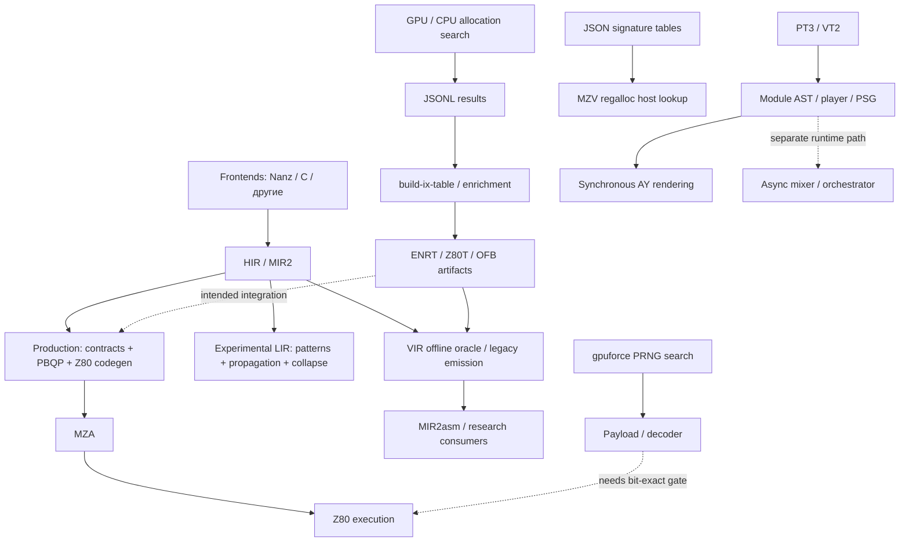

# Глубокий технический аудит MinZ / GPU-search / WFC / PRNG / AY

**Дата:** 2026-09-19. **MinZ:** `7178a528`; compiler sources совпадают с `f51171a5`.
**Связанные документы:** [первый обзор](2026-09-19-Ecosystem-Audit-RU.md), [бэклог](../docs/project/BACKLOG.md), [протокол и воспроизведение](audit-2026-09-19-deep/README.md), [provenance](audit-2026-09-19-deep/provenance.json).

## 1. Главный вывод

В экосистеме накоплен значительный объём работающего кода и результатов поиска, но главный разрыв находится **между вычисленным кандидатом и обоснованным решением использовать его в компиляторе**. На этом переходе теряются идентичность задачи, физические ограничения регистров, проверка результата и происхождение данных.

Глубокий проход подтвердил новые дефекты, которых недостаточно было видно из прежнего обзора:

1. GPU может вернуть правильный минимум стоимости **в паре с неправильным assignment**. В нашем небольшом прогоне это случилось в 12 из 80 задач.
2. В проверенном 4v ENRT-файле 32 211 из 123 453 сохранённых feasible assignments конфликтуют по physical aliases. Это **26.09% данного feasible-набора**, не процент всех таблиц или программ.
3. Dense generator не сохраняет тот порядок, который предполагает positional lookup; параллельная выдача дополнительно недетерминирована. В существующей 6v-таблице найден прямой контрпример: запись 1549 содержит шесть назначений, но consumer интерпретирует этот индекс как трёхрегистровую задачу.
4. Даже ENRT-reader после августовского record-count fix принимает запись с отсутствующими flags/metrics, подставляя нули. Z80T v2 принимает несовпадение count и недопустимые location IDs.
5. `build-ix-table` превращает ответ GPU server с `error: "parse error"` в обычную infeasible-запись и возвращает success.
6. AY race detector подтвердил гонки mixer. Синхронный renderer при этом работает, но даёт разные результаты при перестановке двух register writes, которые затрагивают разные настройки.

**Production MinZ не следует автоматически объявлять сломанным этими находками.** VIR удалён из его обычного codegen-пути; binary-table lookup дополнительно исключает shapes с 16-bit values. Ошибки существенны для oracle, экспериментальных consumers и будущей интеграции GPU-данных. Эти границы ниже указаны отдельно.

## 2. Методика и что именно было проверено

Аудит включает чтение текущего source, небольшие синтетические контрпримеры, полный структурный/доменный проход малого 4v-артефакта и ограниченные реальные GPU-запуски. Это не обзор по README и не пересказ прошлых отчётов.

| Проверка | Объём | Наблюдаемый результат |
|---|---:|---|
| GPU physical aliases | 5 задач, по одному assignment | H/HL, L/HL, B/BC приняты; H/H отвергнут; A/HL принят |
| GPU cost/assignment consistency | 80 задач × 7⁵ assignments | 80 ответов, 12 несогласованных пар cost/assignment |
| Полный 4v ENRT | 156 506 записей, 4 104 402 bytes | Header/count/EOF совпали; 32 211 alias conflicts |
| Порядок generator | 162 shapes, 1 и 4 workers | 160/162 позиций неверны уже при одном worker; 3 parallel runs имеют разные hashes |
| Существующий dense 6v binary | Header и начало потока до трёх feasible records | Позиционная схема несовместима с consumer |
| MinZ readers/index | 4 маленьких файла + два shape keys | Приняты missing metadata, неверный count, invalid locations; invalid mask пересекается с valid key |
| Upstream ENRT reader | Header=2, body=1 | Возвращает обычный EOF после одной записи |
| AY orchestrator | `-race`, один targeted test, timeout 5 s | Data races и panic; тест завершился failure до timeout |
| Синхронный AY renderer | 4410 samples × 3 renders | Ненулевой детерминированный звук; 4390 samples различаются при перестановке reg7/reg8 writes |
| MIR2 focused tests | 16 test events | 16 pass, 0 fail, 0 skip |
| Lanz/Lizp imports через CLI | 2 программы, по 2 `via z80` asserts | Обе успешно скомпилированы и assertions пройдены |
| PRNG Che cascade | Compile + MZA assemble | Оба этапа успешны; экранный replay не выполнялся |

GPU-код собран заново из `z80-optimizer/cuda/z80_regalloc.cu` в `/tmp`, а не взят из неизвестного cached binary. Использован уже установленный Go 1.25.0 для соседних проектов и Go 1.24.3 для MinZ. Полные исходные revision IDs и hashes выбранных файлов — в provenance JSON.

Ограничения: не проверены все большие таблицы, полный corpus всех frontends, hardware timing, новая генерация exhaustive libraries, все AY fixtures и соответствие каждого GPU-op реальному Z80. Отчёт не устанавливает мировую новизну алгоритмов и не содержит нового литературного обзора. Исследовательские перспективы ниже — инженерная оценка существующего кода.

## 3. Карта реально связанных компонентов



Существенные различия:

- `cmd/minzc` не имеет `pkg/vir` в dependency closure на проверенной базе. Большие regalloc files не ускоряют production автоматически.
- MZV `@regalloc_lookup` вызывает `LookupByKey`, который смотрит **map JSON entries**. Это не binary-index fallback из `RegAllocTable.Lookup`. Сам факт импорта `vir` не доказывает, что этот host function использует 298M binary records.
- GPU peephole application живёт в `pkg/vir/pipeline.go`; обычный PBQP codegen имеет собственный `asmPeepholePass` в MIR2.
- `pt3render` использует `NewRenderAyumi`, а падающий `TestOrchestrator` — многопоточный mixer. Они делят часть synth implementation, но lifecycle различается.
- Есть готовый `fun/che_cascade.nanz`, тогда как соседний `gpuforce/nanz/lfsr_decoder.nanz` содержит conceptual/stub pieces. Их нельзя объединять в один показатель «decoder готов».

## 4. D01 — GPU minimum и assignment рассогласованы

**Статус:** воспроизведено на GPU. **Приоритет:** P0 для generator correctness.

В `cuda/z80_regalloc.cu:regalloc_kernel` выполнены два независимых атомарных обновления:

```cpp
old = atomicMin(d_bestCost, cost);
if (cost <= old) {
    atomicExch(d_bestIdx, assignmentIdx);
}
```

Возможное исполнение:

1. Thread A улучшает cost до 18 и приостанавливается до записи index.
2. Thread B улучшает cost до 16 и записывает свой index.
3. Thread A продолжает и перезаписывает index assignment стоимостью 18.
4. На хост приходит `(cost=16, index_for_cost_18)`.

Комментарий обещает CPU verification, но просмотренный путь `solve_one → print_json_result` декодирует index и печатает пару без повторного расчёта стоимости assignment.

Проверка использует пять независимых variables с семью locations и известной аддитивной стоимостью. Interference отсутствует; минимум можно вычислить независимо как сумму пяти минимумов. Это изолирует ошибку публикации результата от сложностей модели Z80.

**Наблюдение:** 12/80 результатов противоречат собственной cost model. Пример case 10: reported/expected minimum=16, возвращённый `[2,5,5,3,3]` стоит 18. [Полный результат](audit-2026-09-19-deep/gpu-cost-pair.json), [скрипт](audit-2026-09-19-deep/check_gpu_cost.py).

Число ошибок зависит от GPU scheduling; 12/80 — результат одного прогона, не постоянная частота. Равные locations здесь допустимы, потому что задачи намеренно не имеют interference edges.

**Исправление:** публиковать согласованную пару через pair reduction либо второй проход поиска witness для найденного minimum; packed atomic key допустим только с проверенными диапазонами cost/index. На host всегда пересчитывать feasibility и cost выбранного witness. Принимать GPU-result только после совпадения. Tie-break должен быть детерминированным, если нужна byte-for-byte воспроизводимость таблиц.

## 5. D02 — физическое перекрытие регистров отсутствует в GPU-модели

**Статус:** GPU-repro + полный проход одного реального артефакта. **Приоритет:** P0 для mixed-width tables.

GPU `check_interference` запрещает только `assignment[a] == assignment[b]`. Но location IDs H и HL различны, хотя хранение перекрывается.

Контрольные задачи с явным interference edge:

| Forced assignment | GPU result | Оценка |
|---|---|---|
| H, HL | feasible, cost 8 | Перекрываются |
| L, HL | feasible, cost 8 | Перекрываются |
| B, BC | feasible, cost 8 | Перекрываются |
| H, H | infeasible | Контроль равных IDs работает |
| A, HL | feasible, cost 8 | Контроль непересекающихся locations |

[Входы](audit-2026-09-19-deep/gpu-alias-input.jsonl) и [выходы](audit-2026-09-19-deep/gpu-alias-output.jsonl).

Для `enriched_4v.enr` независимо декодированы все записи, восстановлены widths/domains/interference по enumeration scheme и проверены physical-register footprints. Файл структурно полный: 156 506 records; feasible=123 453, infeasible=33 053. Domain membership, assignment length и same-ID interference нарушений не дали. **32 211 feasible assignments имеют физическое перекрытие на interference edge.**

Первый контрпример: index=37, widths=[16,8], domains=[HL, any GPR8], interference=1, assignment=[HL,L], cost=12. [Результат](audit-2026-09-19-deep/table-4v.json), [проверяющий скрипт](audit-2026-09-19-deep/verify_4v.py).

Это не означает, что все соответствующие **shapes** infeasible: часть можно переназначить законно. Пересчитать нужно witness и стоимость, а не просто удалить shapes. Проверка физического overlap также не доказывает полную legality: flags, call clobbers, instruction ties и DD/FD restrictions — следующие уровни.

**Существующая защита:** MinZ binary fallback использует `!shapeUses16Bit(*shape)`. Поэтому найденные mixed-width assignments не должны проходить этот конкретный путь. Защиту необходимо сохранить до валидации модели; она не превращает сам mixed-width dataset в корректный.

## 6. D03 — positional lookup не соответствует dense generator

**Статус:** source trace, исполняемый маленький repro и контрпример из существующего binary. **Приоритет:** P0 для dense-table consumers.

Consumer `EnrichedIndexOfWithLocSets` предполагает вложенность:

```text
nVregs → width combination → location-set combination → interference mask
```

`gen6v-ix-feed`:

```text
только заданный nVregs → только masks с treewidth >= threshold
→ mask → width combination → location-set combination
```

Кроме перестановки осей, workers отправляют отдельные строки в общий channel по готовности. `build-ix-table` сохраняет порядок поступления и не получает shape identity. Сам GPU JSON answer содержит cost/assignment, но не исходный shape key.

Малый repro `-nv 2 -min-tw 0` генерирует полный набор из 162 shapes. Все keys уникальны и полный набор действительно покрыт. Но при одном worker первые consumer indices: `0,2,4,...,30`; **160 из 162 позиций не совпадают** с consumer order. Три запуска с четырьмя workers дали разные SHA-256. [Данные](audit-2026-09-19-deep/feed-order.json).

Проверка реального `ix_expanded_6v_dense.bin` ещё сильнее: record index 1549 имеет nVregs=6 и assignment `[9,0,2,3,4,0]`, тогда как полный consumer index 1549 относится к nVregs=3. Его widths — 8/8/8, loc-set indices — 4/4/5, mask=3. Первый returned location 9 означает HL и не удовлетворяет даже этому u8 domain. Файл не загружался целиком; записи прочитаны потоково с начала. [Контрпример](audit-2026-09-19-deep/dense-index.json).

В `Lookup` assignment дополнительно усечётся по `len(vregList)`, поэтому неверная длина сама по себе не гарантирует отказ. Это установленная несовместимость хранения и lookup; полноценный miscompile через CLI не воспроизводился.

**Исправление:** передавать stable shape ID от producer через server и converter; хранить enumeration version, domain version, filter/min-treewidth и ordering. Для sparse dense-subset нужен rank map или keyed index. Полный position-only формат допустим только при полном покрытии и canonical order. Converter должен проверять duplicate/missing IDs, а не надеяться на стабильность parallel scheduling.

## 7. D04 — binary validation проверяет только часть контракта

**Статус:** воспроизведено маленькими файлами. **Приоритет:** P0 для readers; объём исправления небольшой.

[Probe](audit-2026-09-19-deep/minz-probe/main.go), [выход](audit-2026-09-19-deep/minz-probe.json):

| Нарушение | Наблюдаемый результат |
|---|---|
| ENRT: count=1, есть cost/assignment, отсутствуют flags и все 12 metrics | Success, flags/metrics заполнены нулями |
| Z80T v2: count=2, одна infeasible record | Success, records=1 |
| Z80T v2: assignment locations 255 и 254 | Success |
| Shape с nVregs=2 и interference mask=2 | Success, index=2 — тот же, что у другой valid shape |

ENRT record-count check не защищает от обрыва **внутри последней записи**: errors `binary.Read` flags/metrics игнорируются. В upstream `pkg/enr.Reader.Next` reads metadata проверяются лучше, но declared NEntries не защищён от раннего EOF: header=2/body=1 возвращает обычный EOF. [Upstream probe](audit-2026-09-19-deep/upstream-probe.json).

Необходим полный контракт: поддерживаемые dimensions, nv bounds, location IDs, valid interference bits, наличие всех полей, точный body count, отсутствие лишнего хвоста, declared schema и ограничения памяти. Unknown/unsupported format должен иметь отдельную причину отказа.

### Память

На текущем amd64 `unsafe.Sizeof(EnrichedEntry{}) = 64`. Для header count=298 669 842 только slice entries потребует **19 114 869 888 bytes**. Сверх этого loader держит raw body (~1.684 GB), assignment arena и ранее загруженные таблицы. Это расчёт по коду/размерам, не измерение peak RSS.

Комментарий о graceful skip при недостатке памяти не заменяет проверку budget: до `make` нет такого preflight. Для lookup-инфраструктуры нужны mmap/compact representation либо explicit opt-in/load budget; giant auto-load из HOME — плохая единица интеграции.

## 8. D05 — error превращается в математическое infeasible

**Статус:** воспроизведено actual converter. **Приоритет:** P0 для достоверности datasets.

Server при parse failure печатает:

```json
{"cost":-1,"assignment":[],"error":"parse error"}
```

`cmd/build-ix-table` не моделирует `error` в record struct; любая отрицательная стоимость превращается в byte `0xFF`. Небольшой repro дал exit=0 и Z80T с одной infeasible record. [Артефакт](audit-2026-09-19-deep/builder-error.json).

Следовательно, доля infeasible может смешивать доказанное отсутствие допустимого назначения и сбой инфраструктуры. Из этого нельзя выводить register-pressure phase transition или coverage.

**Исправление:** tagged result `solved | infeasible | error | timeout | unknown`, обязательный shape ID, проверенный witness для solved. Не писать final artifact при error/missing result без явной маркировки partial. Сначала временный файл и проверка, затем атомарная публикация.

## 9. Что именно оптимизируют разные solvers

| Механизм | Реальная переменная решения | Что нельзя из этого заключать |
|---|---|---|
| GPU `z80_regalloc` | Один location на vreg на всю задачу, выбор допустимых op patterns | Не является полноценным dynamic live-range splitting |
| Dense feed | Domains + interference; generated patterns имеют одинаковую cost=4 | Минимум этого synthetic objective не равен минимуму машинного кода |
| LIR propagation/collapse | Operand domains с PBQP hints, последовательный collapse, interblock propagation | Не доказывает глобальный optimum и не использует entropy ordering |
| VIR SMT | Более богатая модель, включая per-instruction location machinery | Correct solver model не гарантирует correctness дальнейшего emit |
| Production PFCCO | Register-class choices параметров/returns, до четырёх greedy passes | Название `globally-optimal` в комментарии не является доказательством глобальной оптимальности |

В GPU `evaluate_cost` assignment неизменен. `prevLoc[v]` получает только `assignment[v]`; проверка «location changed since last use» поэтому не начисляет стоимость реального live-range relocation в этой модели. Это вывод из invariants функции, не отдельный benchmark.

В `gen6v-ix-feed` стоимость допустимого решения при фиксированном graph равна `4 × (nVregs + number_of_edges)`: каждый synthetic op имеет единственный pattern с cost=4. Такой результат полезен как **feasibility witness**. Называть его optimal emitted program без дальнейшего instruction scheduling/legality/measurement нельзя.

## 10. WFC/LIR: конструктивный потенциал и ограничения

Код propagation, interblock constraints и PBQP-guided choice реален. Это полезный слой моделирования нерегулярной ISA, а не пустое название. Но выбирать следующий шаг нужно по ограничениям реализации:

- `Entropy()` не используется `Collapse()`; выбор идёт по порядку instructions.
- `Loc.Alias` читается Z3 path, но инициализация aliases в просмотренном descriptor отсутствует.
- `ProgWFC.Propagate()` имеет предел десять rounds и возвращает их число; достижение предела не выделено как nonconvergence diagnostic.
- Retry в `lirCodegenFlat` отвергает текущие назначения всех dst cells, а не локальный conflict set.
- После последней неудачной validation попытки имеется явное `return asm, nil` с комментарием `warn-only`.
- Emit-time repair (`fixInvalidZ80Template`, half-reg push/pop fixes) может дать encodable assembly, но сам по себе не доказывает сохранение semantics.

Последние четыре пункта — **source findings**, не новые воспроизведённые LIR miscompile. Историческая hardening-ветка уже представлена в master по patch-id; повторный merge это не исправит.

Рекомендуемый эксперимент: один фиксированный корпус, три режима — существующий sequential choice; most-constrained-first choice; bounded search с conflict sets. Одинаковые templates, aliases, verifier и cost objective. Измерять execution pass, bytes, T-states, compile latency и fallback frequency. Если search не даёт выигрыша, оставить propagation и назвать его прямо.

## 11. Oracle/PFCCO: полезная база, ещё не независимый сертификатор

`vir-oracle` вызывает `vir.CodegenModule`, то есть наследует большой путь выбора/emit/fallback. Он сравнивает instruction counts, а не independently checked semantics. `solve_ms` — module elapsed, поделённое поровну между results; это не измерение latency конкретной функции.

`countPerFunc` переходит на любой label без начальной точки и считает непустые/неcomment строки; для block labels/data это слабый proxy. JSON-result пока не задаёт строгий bound/certificate/assignment validation contract. Negative delta означает повод исследовать, а не установленный выигрыш.

Production PFCCO в `mir2/contracts.go` возвращает greedy implementation, не `OptimizeContractsPBQP`; PBQP variant сохраняется отдельно с описанным bias. Это отдельный уровень от **PBQP register allocator**. Смешивать два употребления PBQP в метриках нельзя.

Положительное свидетельство текущего production: targeted MIR2 command (`Contract|Parallel|Div|Mod|SMC`) дал 16 pass, без failures/skips; небольшой div/mod/nested-call CLI repro уже проходил в первом аудите. Это основание продолжать с production baseline, но не гарантия всех ABI/recursion cases.

Наиболее близкий исследовательский результат — честная PFCCO ablation: off/on, pinned corpus, одинаковая семантика, bytes/T-states, число adapters и call-edge weights. Oracle должен стать отдельным сервисом проверки candidate/model, а не источником неподтверждённых сравнительных процентов.

## 12. Superoptimization: граница доказательства

`pkg/search/verifier.go` заявляет exhaustive equivalence, но:

- полный sweep использует A и carry; остальные initial flag bits не перебираются как независимые измерения;
- при >=3 дополнительных registers или SP применяется reduced sweep;
- `cpu.State` содержит **один виртуальный memory byte M**, общий для indirect accesses.

Таким образом, полная проверка в этой модели не равна автоматически equivalence по полной памяти и всем Z80 states. Особенно важно фиксировать ограничения для DAA/flag-sensitive и memory patterns. Этот аудит **не предъявляет конкретное ложноположительное peephole rule**: установлена ограниченность доказательной процедуры, а не ошибочность всех правил.

В MinZ `PeepholeRule` не хранит machine-readable proof domain, dead flags или required alias assumptions. Matcher работает по строкам; `Lookup3` реализован, но просмотренный `applyGPUPeepholeRules` применяет только пары. Это объясняет, почему «rules loaded» и «rules used» — разные метрики.

Практический путь: выбрать несколько частых production patterns → формализовать preconditions → independent execution verifier → переносить families, а не тысячи literal strings. 6502-search полезен как инженерный пример normalization, но новая ISA требует своей semantics validation.

## 13. AY: разделить sync synthesis, async streaming и player fidelity

### D06: mixer ownership и shutdown

`go test -race ./pkg/ayumi -run '^TestOrchestrator$' -count=1 -timeout 5s` подтвердил конкурентные записи в `mixBuffer` из двух collectors и конфликт с mix loop. [Сокращённый race trace](audit-2026-09-19-deep/ay-race-excerpt.txt).

Причины видны в `orchestrator.go`:

1. Collectors append в один slice без lock/единого владельца.
2. `Stop()` закрывает channels, не дожидаясь producers/mixer.
3. Receive на closed input не проверяет `ok`, поэтому может добавлять zero samples в бесконечном цикле.
4. Cancel в `Start()` выполняется defer после `wg.Wait`, а collectors завершаются по этому cancel: shutdown dependency замыкается.
5. Orchestrator добавляет mixer/glyph в свой WaitGroup, но их запуск не вызывает соответствующий `orch.wg.Done()`.

Пункты 3–5 — source analysis; отдельный timeout reproduction каждого не требовался после race/panic. Исправлять нужно lifecycle и ownership, а не закрывать panic recover.

`GlyphEngine.Start/Stop/AddSample/processFrames` содержит заглушки, `GetGlyphChannel` создаёт новый channel. Это не готовый feature extraction pipeline.

### D07: синхронный renderer работает, но register writes зависимы от порядка

Контрольный render 4410 samples дал 4390 nonzero, RMS≈0.12547, peak≈0.49825; повтор совпал по SHA-256. Это подтверждает полезный batch-render путь, независимый от mixer lifecycle.

Однако перестановка `WriteRegister(7,62)` и `WriteRegister(8,16)` **до генерации первого sample** меняет 4390 samples. Причина в reg7 ветке `render.go`: устанавливает `eOn := 0`, хотя envelope-selection отдельно задаётся reg8/9/10. Повторная запись mixer отключает уже включённый envelope. [Probe](audit-2026-09-19-deep/audio-probe/main.go), [результат](audit-2026-09-19-deep/audio-render.json).

Нужен register-latch contract и tests независимых writes; затем PSG frame ordering tests. Нельзя заключать, что этим объясняются все исторические `take5` differences: fixture matrix не прогонялась.

Правильная последовательность: sync register semantics → deterministic player/PSG parity → отдельно streaming ownership/timestamps/backpressure → затем synthesis search. Async «первый sample ненулевой» — слабый тест при FIR warmup; нужен интервал после прогрева, а не произвольный sleep.

## 14. PRNG / graphics: ближайший самостоятельный demo-трек

`fun/che_cascade.nanz` на текущем compiler успешно проходит compile и MZA assemble. Это более сильная стартовая точка, чем писать decoder с нуля. Execution/frame equivalence в этом проходе не проверялись.

Соседний `nanz/lfsr_decoder.nanz` содержит `bit_test`, возвращающий константное поведение, и `decode_cost`, возвращающий оценку. Его 4-byte-frame и timing claims нельзя считать измерением полного decoder. Cascade-stream v2 имеет отдельную спецификацию carrier/payload и estimated decoder overhead; она требует своего versioned replay fixture.

Оптимизационная цель PRNG-графики должна включать:

```text
payload bytes + decoder bytes + tables/working memory
visual error при фиксированной маске/метрике
target decode T-states / frame budget
```

Минимальный полезный артефакт: одна зафиксированная картинка, один payload, CPU reference decoder, MinZ decoder, одинаковый bitmap/hash. После этого joint/cascade/CP search можно сравнивать честно. Проценты ошибки разных ROI, resolutions и masks напрямую несопоставимы.

Локальная модификация `prng_budget_search.cu` (`--apply-mask`) должна попасть в provenance выбранного результата. GPU score и host apply обязаны использовать одну семантику; рассогласование здесь пока **гипотеза для проверки**, не подтверждённый defect.

## 15. Что изменяется в трактовке красных frontend tests

Две программы импортировали функции из `.lanz` и `.lizp` через реальный MinZ CLI и успешно выполнили по два Z80 asserts. [Результат](audit-2026-09-19-deep/import-cli.json).

Это опровергает широкую формулировку «cross-language imports не работают». Старые tests проверяют имена HIR functions до следующего этапа; необходимо отдельно разобрать naming/pruning/expectations. Причина конкретных unit failures здесь не установлена, поэтому автоматическая правка frontend вместо тестового контракта не обоснована.

Аналогично ABAP missing `@abaplint/core` и z80testing parser failures нельзя считать доказанными неверными instructions. Baseline должен иметь категории: setup, unsupported, stale expectation, semantic wrong-code, timeout, oracle-only. Общая краснота полезна только после такого разделения.

## 16. План исправлений по полезности и зависимостям

| Порядок | Работа | Тип | Критерий готовности |
|---:|---|---|---|
| 1 | A1: тестовый exit code | Quick win | Падающий test даёт failing make/CI |
| 2 | D04/D05: reader contract и error propagation | Quick win + небольшая основа | Все synthetic invalid inputs отвергаются; error не становится infeasible |
| 3 | D01: согласованный GPU witness | Фундамент, узкий scope | Host rescore каждого результата; seeded probes без mismatch |
| 4 | D03: stable shape identity и sparse indexing | Фундамент | Key round-trip независимо от workers/order/filter; existing dense files не подключаются позиционно |
| 5 | D02: aliases в producer/consumer/verifier | Фундамент | Forced conflicts отвергаются; 4v rerun проверен физически |
| 6 | A3/A4 + C1: чистый execution baseline | Фундамент | Tracked fixtures, skip accounting, working imports не объявлены broken |
| 7 | D07: AY register semantics | Quick win | Independent write-order cases совпадают; sync render stable |
| 8 | D06: AY ownership/shutdown | Фундамент | Repeated Start/Stop contract, race-clean, bounded shutdown |
| 9 | I2: Che bit-exact replay | Практический результат | CPU/MIR2/Z80 bitmap match и target timing |
| 10 | F1/F2: PFCCO ablation | Измерительный эксперимент | Corpus-wide execution/bytes/T-states/provenance |
| 11 | G5: controlled WFC/search experiment | Исследование | Изолированный measured win, bounded cost, safe fallback |

D01–D05 — P0 **внутри GPU-artifact track**, а не причина остановить рабочий PBQP compiler. PRNG replay и синхронное AY исправление могут двигаться независимо. Полную перегенерацию гигантских таблиц проводить только после исправления модели и формата.

## 17. Архитектура следующей итерации

Вместо бесконтрольного расширения surface area предлагается пять проверяемых контрактов:

1. **Problem contract:** stable key; ISA/domain version; widths; interference/aliases; allowed locations; ties/clobbers; objective и schedule assumptions.
2. **Solver contract:** solved/infeasible/unknown/error/timeout; witness; objective; proof scope. Отдельная независимая checker-функция.
3. **Artifact contract:** format/order/filter version; exact counts; hashes; producer revision; completeness; memory budget. Ошибка не превращается в data.
4. **Consumer contract:** compatible domain check; safe miss/fallback; provenance и hit/reject counters; результат не подставляется при несовпадении shape.
5. **Execution contract:** compiler output собирается, запускается и совпадает с reference на поддерживаемом corpus; positive/negative controls проверяют сам harness.

Исследовательская ценность сохраняется: таблицы можно превратить в проверяемые caches, PFCCO — в измеряемую оптимизацию, propagation — в полезный constraint layer, PRNG — в компактный codec experiment, AY — в reproducible sound pipeline. Но **computed**, **feasible in a model**, **independently checked**, **integrated** и **beneficial on a workload** должны стать разными явными состояниями.

## 18. Что этот коммит делает и чего не утверждает

Коммит сохраняет аудит, probe sources, небольшие результаты и уточняет бэклог. Production compiler, соседние source trees и большие datasets не исправляются этим коммитом. Все перечисленные дефекты остаются открытыми, пока не появятся отдельные implementation changes и проверки.

Не установлены: доля неправильных программ в production, полная ошибка всех GPU-таблиц, invalidity каждого peephole rule, готовность всех targets, parity всех PT3 tracks или глобальная оптимальность текущих solvers. Установлены конкретные контрпримеры и несколько работающих путей, на которых можно строить следующий этап.
